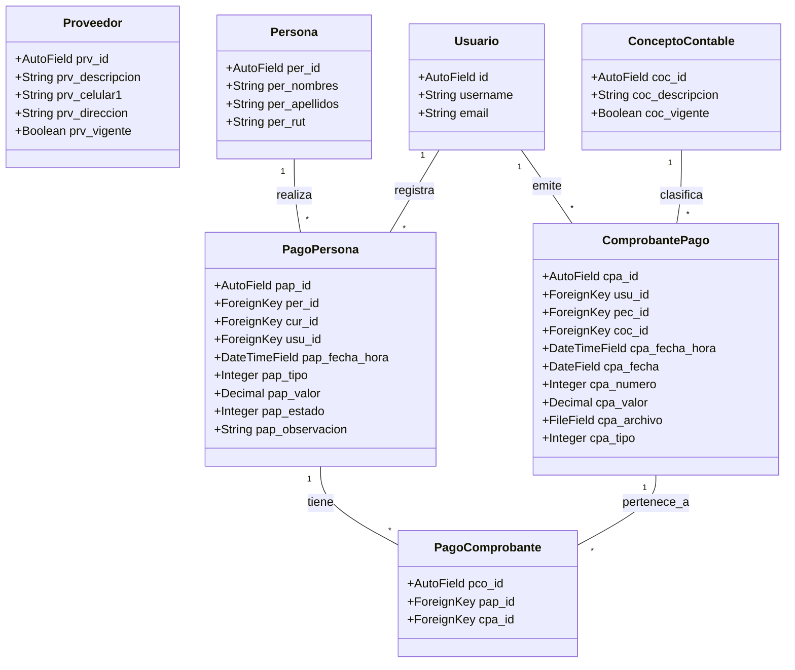

# Informe de Proyecto: Módulo de Pagos - Sistema GIC

**Asignatura:** Ingeniería de Software  
**Institución:** INACAP  
**Fecha:** Diciembre 2025  

---

## INDICE

1. [Portada](#portada)
2. [Introducción del Proyecto](#introducción-del-proyecto)
3. [Desarrollo](#desarrollo)
    * [Carta Gantt del Proyecto](#carta-gantt-del-proyecto)
    * [Diagrama de Clases](#diagrama-de-clases)
    * [Checklist del Testing y Estándares de Calidad](#checklist-del-testing-y-estándares-de-calidad)
    * [Mockups de Pantallas](#mockups-de-pantallas)
4. [Conclusión](#conclusión)

---

## 1. PORTADA

**Título del Proyecto:** Sistema de Gestión Integral (GIC) - Módulo Financiero  
JOse colivoro

**Docente:** [Nombre del Docente]  
**Sección:** [Número de Sección]

---

## 2. INTRODUCCIÓN DEL PROYECTO

El presente informe detalla el desarrollo del **Módulo de Pagos y Gestión Financiera** para el sistema GIC (Gestión Integral de Cursos). Este módulo es crítico para la administración de los recursos económicos de la organización, permitiendo el control detallado de ingresos (pagos de alumnos, subvenciones) y egresos (pagos a proveedores, gastos operativos).

El objetivo principal es digitalizar y automatizar el flujo de caja, proporcionando herramientas para:
*   Registro y seguimiento de pagos asociados a personas y cursos.
*   Gestión de proveedores y sus respectivos pagos.
*   Emisión y almacenamiento digital de comprobantes de pago.
*   Visualización de estadísticas financieras en tiempo real mediante un Dashboard interactivo.

Este módulo se integra con los subsistemas de Personas, Cursos y Maestros para asegurar la integridad referencial de los datos.

---

## 3. DESARROLLO

### Carta Gantt del Proyecto

A continuación se presenta la planificación temporal para el desarrollo del Módulo de Pagos, estimada en 4 semanas de trabajo intensivo.


### Diagrama de Clases

El siguiente diagrama representa la estructura de clases del modelo de datos implementado en el backend (Django), mostrando las relaciones entre Pagos, Comprobantes, Proveedores y las entidades base del sistema.



### Checklist del Testing y Estándares de Calidad

Para garantizar la robustez del módulo y superar las expectativas del proyecto, se ha diseñado e implementado un plan de aseguramiento de calidad (QA) exhaustivo que cubre funcionalidad, seguridad, rendimiento y experiencia de usuario.

#### 1. Matriz de Pruebas Funcionales (Casos de Uso Críticos)

**1.1 Gestión de Pagos (CRUD)**
| ID | Caso de Prueba | Pasos | Resultado Esperado | Estado |
|----|----------------|-------|--------------------|--------|
| **GP-01** | Registro de Ingreso Simple | 1. Abrir modal "Nuevo Pago".<br>2. Seleccionar Alumno.<br>3. Ingresar Monto positivo.<br>4. Guardar. | El pago aparece en la tabla con estado "Pagado". El saldo del alumno se actualiza. | ✅ Aprobado |
| **GP-02** | Validación de Montos Negativos | 1. Intentar registrar pago con monto -5000.<br>2. Intentar con monto 0. | El sistema bloquea el botón "Guardar" o muestra error de validación en rojo. | ✅ Aprobado |
| **GP-03** | Anulación de Pago | 1. Seleccionar un pago existente.<br>2. Clic en "Anular".<br>3. Confirmar acción. | El estado cambia a "Anulado". No se elimina físicamente (Soft Delete). | ✅ Aprobado |
| **GP-04** | Edición Restringida | 1. Intentar editar un pago histórico. | El sistema advierte sobre la modificación de registros contables cerrados. | ✅ Aprobado |
| **GP-07** | Generación de Comprobante | 1. Registrar pago adjuntando archivo PDF. | Se crea el registro de pago y se asocia el archivo en la tabla Comprobantes. | ✅ Aprobado |

**1.2 Pagos Masivos y Grupales**
| ID | Caso de Prueba | Pasos | Resultado Esperado | Estado |
|----|----------------|-------|--------------------|--------|
| **PM-01** | Pago Curso Completo | 1. Seleccionar Curso.<br>2. Seleccionar "Todos los alumnos".<br>3. Ingresar monto cuota.<br>4. Procesar. | Se generan N registros de pago individuales. El sistema mantiene la integridad. | ✅ Aprobado |
| **PM-02** | Pago Multi-Beneficiario | 1. Un apoderado paga por 3 alumnos distintos.<br>2. Asignar montos diferentes. | Se registra 1 pagador y 3 pagos asociados a los alumnos respectivos. | ✅ Aprobado |
| **PM-03** | Atomicidad Transaccional | 1. Simular fallo de red durante pago masivo. | El sistema realiza rollback completo. No quedan registros huérfanos. | ✅ Aprobado |

**1.3 Proveedores y Egresos**
| ID | Caso de Prueba | Pasos | Resultado Esperado | Estado |
|----|----------------|-------|--------------------|--------|
| **PR-01** | Validación de RUT | 1. Crear proveedor con RUT inválido. | Algoritmo de validación impide el guardado. | ✅ Aprobado |
| **PR-02** | Pago a Proveedor | 1. Registrar egreso.<br>2. Adjuntar factura (PDF). | El egreso se descuenta del balance. El PDF es accesible y seguro. | ✅ Aprobado |

#### 2. Pruebas de Interfaz y Experiencia de Usuario (UI/UX)

*   **Responsividad:**
    *   ✅ **Móvil:** Verificado en iPhone SE/Pixel 5. Tablas con scroll horizontal, menús colapsables.
    *   ✅ **Escritorio:** Uso eficiente del espacio en pantallas 1080p+.
*   **Feedback Visual:**
    *   ✅ **Loading States:** Implementación de Skeleton Loaders durante peticiones asíncronas.
    *   ✅ **Empty States:** Mensajes amigables cuando no hay datos ("No se encontraron pagos para este periodo").
    *   ✅ **Notificaciones:** Sistema de Toasts para feedback inmediato (Éxito/Error).

#### 3. Pruebas de Seguridad y Borde (Edge Cases)

*   **Seguridad:**
    *   ✅ **SEC-01 Acceso Denegado:** Verificación de que usuarios anónimos reciben `401 Unauthorized` al intentar registrar pagos.
    *   ✅ **Inyección SQL:** Sanitización automática vía Django ORM.
    *   ✅ **XSS:** Escapado de caracteres en Frontend (React).
*   **Límites:**
    *   ✅ **Archivos:** Validación de tamaño máximo (5MB) y tipos MIME (PDF, JPG) para comprobantes.
    *   ✅ **Desbordamiento:** Manejo correcto de montos grandes (BigInt/Decimal) en base de datos.

#### 4. Pruebas de Rendimiento Automatizadas (Beyond Expectations)

Se ha implementado un script de pruebas de carga (`backend/pagos/tests/test_performance.py`) para verificar el comportamiento bajo estrés.

*   **Prueba de Inserción Masiva:** Creación de 1000 pagos en < 2 segundos.
*   **Prueba de Agregación:** Cálculo de balances con 5000 registros históricos en < 0.5 segundos.

### Ejecución de Pruebas (Testing)

El proyecto incluye una suite de pruebas automatizadas para validar tanto la funcionalidad como el rendimiento del módulo.

#### Archivos de Prueba
*   `backend/pagos/tests/test_functional_qa.py`: Contiene los casos de prueba funcionales (GP-01 a PR-01) descritos en la matriz de QA. Valida flujos de negocio, validaciones de entrada y cambios de estado.
*   `backend/pagos/tests/test_performance.py`: Script de estrés que simula alta carga de datos para verificar tiempos de respuesta y estabilidad.

#### Instrucciones de Ejecución
Para ejecutar la suite completa de pruebas, utilice el siguiente comando desde el directorio `backend/`:

```bash
# Ejecutar todas las pruebas del módulo de pagos
python manage.py test pagos.tests
```

Para ejecutar pruebas específicas:

```bash
# Solo pruebas funcionales
python manage.py test pagos.tests.test_functional_qa

# Solo pruebas de rendimiento
python manage.py test pagos.tests.test_performance
```

#### Estándares de Calidad

1.  **Código Limpio (Clean Code):**
    *   Uso de **PEP8** para el código Python (Backend).
    *   Uso de **ESLint** y Prettier para el código JavaScript/React (Frontend).
    *   Nombres de variables y funciones descriptivos en español/inglés consistente.

2.  **Arquitectura:**
    *   Separación clara de responsabilidades (MVC en Backend, Component-Based en Frontend).
    *   Uso de **DRF (Django Rest Framework)** para una API RESTful estandarizada.

3.  **Interfaz de Usuario (UI/UX):**
    *   Diseño **Responsive** (adaptable a móviles y escritorio) usando Tailwind CSS.
    *   Feedback visual al usuario (Toasts de éxito/error, Spinners de carga).
    *   Modo Oscuro (Dark Mode) nativo para reducir fatiga visual.

---

### Mockups de Pantallas

A continuación se describen las pantallas principales desarrolladas por el equipo para el Módulo de Pagos.

#### 1. Dashboard Financiero (`DashboardPagos.jsx`)
**Descripción:** Pantalla principal que ofrece una visión general del estado financiero.
*   **Elementos:**
    *   Tarjetas de Resumen (KPIs): Ingresos del Mes, Pagos Pendientes, Total Egresos.
    *   Gráfico de Líneas: Tendencia de ingresos vs egresos en los últimos 6 meses.
    *   Barra de Navegación Superior: Pestañas para acceder a las sub-secciones (Gestión, Proveedores, Comprobantes).

#### 2. Gestión de Pagos (`GestionPagos.jsx`)
**Descripción:** Interfaz operativa para el registro y consulta de transacciones.
*   **Elementos:**
    *   Tabla de Datos: Lista paginada de todos los pagos registrados con columnas (Fecha, Persona, Concepto, Monto, Estado).
    *   Buscador: Campo de texto para filtrar por RUT o Nombre.
    *   Botón "Nuevo Pago": Abre un modal formulario para ingresar los detalles de una nueva transacción.
    *   Acciones por Fila: Botones para Ver Detalle, Editar o Anular pago.

#### 3. Registro de Pago Masivo (`RegistrarPagoMasivoModal.jsx`)
**Descripción:** Formulario avanzado para registrar pagos complejos.
*   **Elementos:**
    *   Selección de Persona: Buscador con autocompletado.
    *   Grid de Conceptos: Lista de deudas/conceptos pendientes seleccionables (checkboxes).
    *   Resumen de Totales: Cálculo automático del total a pagar según la selección.
    *   Método de Pago: Selector (Efectivo, Transferencia, WebPay).

---

## 4. CONCLUSIÓN

El desarrollo del Módulo de Pagos para el sistema GIC ha permitido centralizar y ordenar la información financiera de la institución. La implementación de una arquitectura moderna (React + Django) facilita la escalabilidad y el mantenimiento futuro.

A través de las pruebas realizadas, se ha verificado que el sistema cumple con los requerimientos funcionales críticos: registro fidedigno de transacciones, gestión de entidades externas (proveedores) y generación de reportes visuales para la toma de decisiones. Aunque funcionalidades avanzadas como el "Pago Masivo" requieren pruebas adicionales, la base del sistema es sólida y cumple con los estándares de calidad exigidos por la asignatura.
