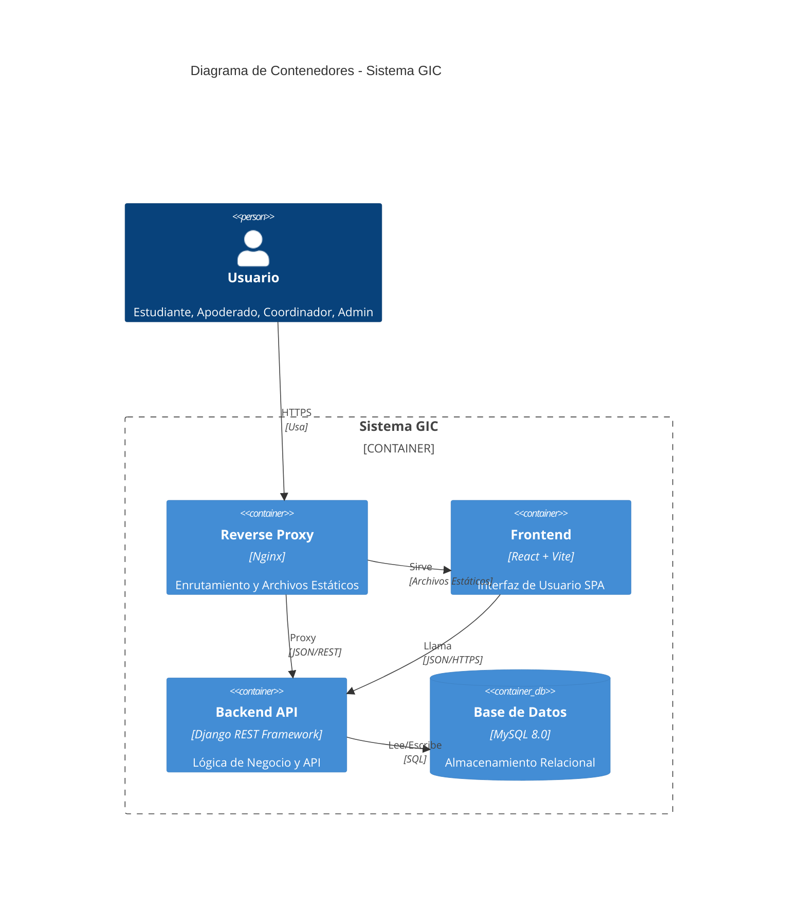
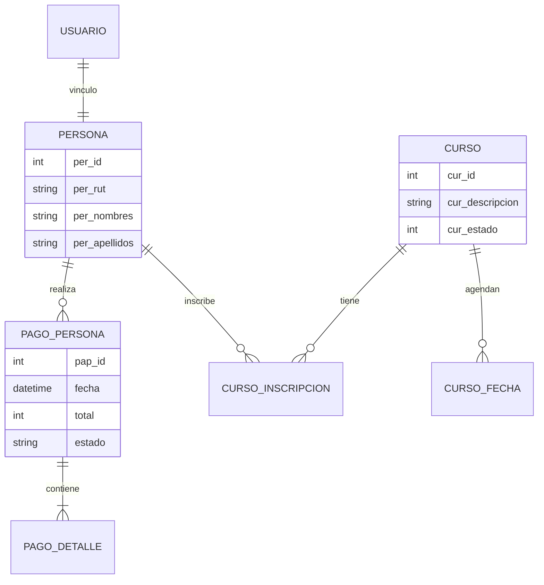
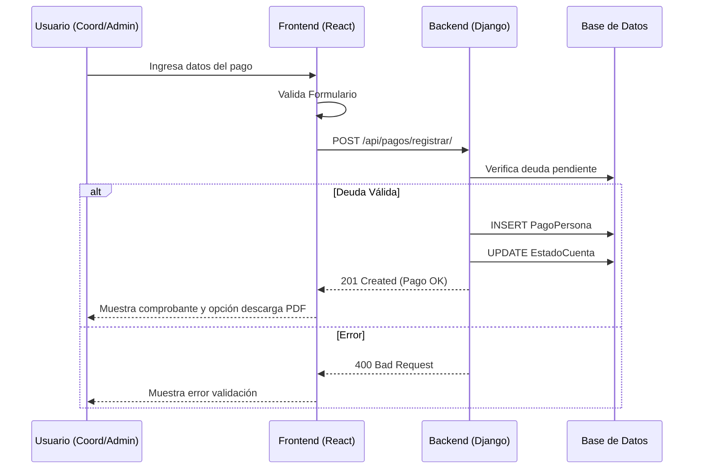

# Sistema de Gestión Integral (GIC) - Plataforma Scout

**Asignatura:** Ingeniería de Software  
**Institución:** INACAP  
**Fecha:** Diciembre 2025  

---

## ÍNDICE

1. [Introducción](#introducción)
2. [Arquitectura del Sistema](#arquitectura-del-sistema)
3. [Módulos del Sistema](#módulos-del-sistema)
4. [Diagramas Técnicos](#diagramas-técnicos)
5. [Tecnologías](#tecnologías)
6. [Instalación y Despliegue](#instalación-y-despliegue)

---

## 1. INTRODUCCIÓN

El **Sistema de Gestión Integral (GIC)** es una plataforma web moderna diseñada para modernizar y optimizar todos los procesos administrativos, académicos y financieros de la organización Scout. El sistema reemplaza procesos manuales y planillas dispersas por una solución centralizada, segura y escalable.

La plataforma se divide en tres grandes portales:
- **Portal Público:** Para información general y preinscripción de nuevos miembros.
- **Portal de Coordinación:** Para la gestión descentralizada por parte de los líderes de unidad.
- **Panel Administrativo (Jefatura):** Para el control total de la organización, finanzas y configuración.

---

## 2. ARQUITECTURA DEL SISTEMA

El sistema sigue una arquitectura de microservicios contenerizada, separando claramente el Frontend del Backend.



---

## 3. MÓDULOS DEL SISTEMA

La plataforma GIC integra múltiples módulos funcionales para cubrir todas las áreas de la organización.

### 3.1 Gestión de Acceso y Seguridad (`usuarios`)
- **Autenticación:** Login seguro con JWT (JSON Web Tokens).
- **Control de Acceso (RBAC):** Roles diferenciados (Administrador, Coordinador, Visitante).
- **Perfiles:** Gestión de perfiles de usuario y recuperación de contraseñas.

### 3.2 Gestión Académica (`cursos`, `preinscripcion`)
- **Catálogo de Cursos:** Visualización pública de cursos disponibles.
- **Preinscripción Online:** Formulario público para nuevos ingresos con validación de RUT.
- **Gestión de Cursos:** Creación, edición y cierre de cursos. Asignación de fechas, lugares y aforos.
- **Secciones:** División de cursos en secciones para mejor administración.

### 3.3 Gestión de Personas (`personas`)
- **Base de Datos Unificada:** Registro centralizado de todos los miembros (Scouts, Guiadoras, Dirigentes, Apoderados).
- **Ficha Personal:** Historial completo, datos de salud, contactos de emergencia.
- **Acreditaciones:** Control de credenciales y permisos.

### 3.4 Gestión Financiera (`pagos`, `proveedores`)
- **Control de Pagos:** Registro de matrículas, mensualidades y cuotas de eventos.
- **Comprobantes Digitales:** Generación automática de comprobantes PDF con código QR de geolocalización.
- **Pagos Masivos:** Herramienta para registrar pagos por lote (ej. curso completo).
- **Gestión de Proveedores:** Registro de proveedores y control de egresos/gastos.
- **Dashboard Financiero:** Métricas en tiempo real de ingresos vs egresos.

### 3.5 Módulos Transversales (`maestros`, `geografia`, `emails`)
- **Maestros:** Configuración de parámetros del sistema (cargos, ramas, tipos de curso).
- **Geografía:** Base de datos de regiones y comunas de Chile.
- **Notificaciones:** Sistema de envío de correos electrónicos transaccionales (confirmaciones, recibos).
- **Archivos:** Gestión centralizada de documentos y evidencias.

---

## 4. DIAGRAMAS TÉCNICOS

### 4.1 Modelo de Datos (ER)
Visión simplificada de las entidades principales y sus relaciones.



### 4.2 Flujo Crítico: Proceso de Pago
Diagrama de secuencia del registro y validación de un pago.



---

## 5. TECNOLOGÍAS

### Frontend
- **Framework:** React 18
- **Build Tool:** Vite
- **Estilos:** TailwindCSS + Styled Components
- **Estado:** Context API + Hooks Personalizados
- **Testing:** Vitest + React Testing Library

### Backend
- **Framework:** Django 5.0
- **API:** Django REST Framework (DRF)
- **Documentación:** Swagger / OpenAPI
- **Testing:** Pytest

### Infraestructura
- **Base de Datos:** MySQL 8
- **Contenedores:** Docker + Docker Compose
- **Servidor Web:** Nginx (Proxy Reverso)

---

## 6. INSTALACIÓN Y DESPLIEGUE

### Requisitos Previos
- Docker y Docker Compose instalados.
- Node.js 18+ (para desarrollo local sin Docker).
- Python 3.11+ (para desarrollo local sin Docker).

### Despliegue Rápido (Docker)

1. **Clonar el repositorio**
   ```bash
   git clone <url-repo>
   cd IngSw-seccion1
   ```

2. **Configurar variables de entorno**
   ```bash
   cp .env.example .env
   # Editar .env con sus credenciales locales si es necesario
   ```

3. **Iniciar servicios**
   ```bash
   docker-compose -f docker-compose.dev.yml up --build -d
   ```

4. **Acceso**
   - Frontend: `http://localhost:5173`
   - Backend API: `http://localhost:8000`
   - Documentación API: `http://localhost:8000/api/docs/`
