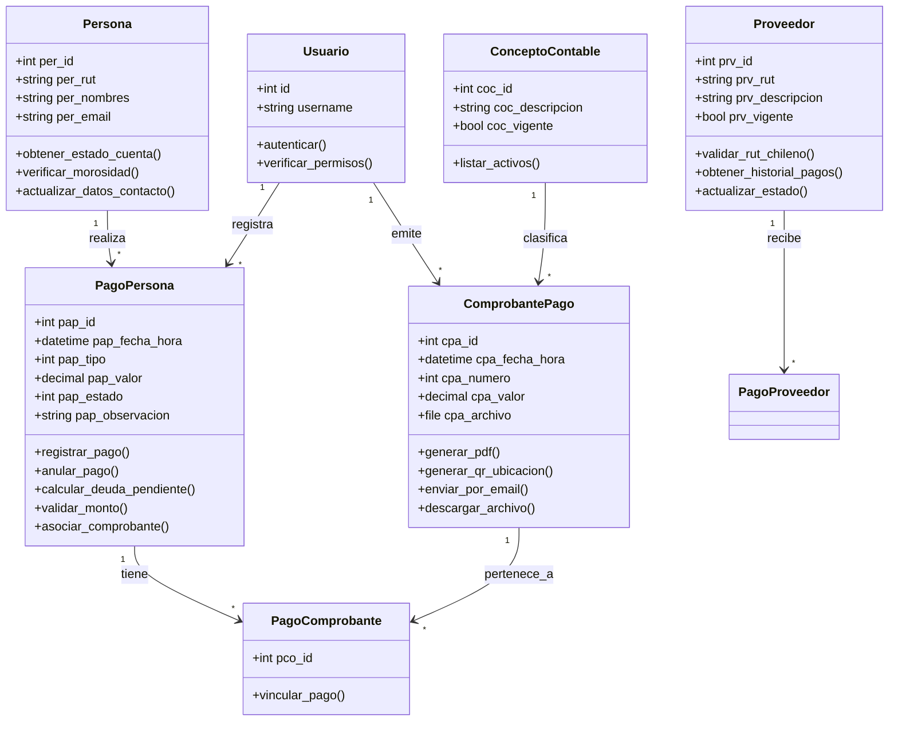

# Informe de Proyecto: Módulo de Pagos - Sistema GIC

**Asignatura:** Ingeniería de Software  
**Institución:** INACAP  
**Fecha:** Diciembre 2025  

---

## INDICE

1. [Portada](#portada)
2. [Introducción del Proyecto](#introducción-del-proyecto)
3. [Desarrollo](#desarrollo)
    * [Carta Gantt del Proyecto](#carta-gantt-del-proyecto)
    * [Diagrama de Clases](#diagrama-de-clases)
    * [Checklist del Testing y Estándares de Calidad](#checklist-del-testing-y-estándares-de-calidad)
    * [Mockups de Pantallas](#mockups-de-pantallas)
4. [Conclusión](#conclusión)

---

## 1. PORTADA

**Título del Proyecto:** Sistema de Gestión Integral (GIC) - Módulo Financiero  
**Integrantes:** José Colivoro

**Docente:** [Nombre del Docente]  
**Sección:** [Número de Sección]

---

## 2. INTRODUCCIÓN DEL PROYECTO

El presente informe detalla el desarrollo del **Módulo de Pagos y Gestión Financiera** para el sistema GIC (Gestión Integral de Cursos). Este módulo es crítico para la administración de los recursos económicos de la organización, permitiendo el control detallado de ingresos (pagos de alumnos, subvenciones) y egresos (pagos a proveedores, gastos operativos).

El proyecto nace de la necesidad de modernizar los procesos administrativos de la institución, los cuales se llevaban a cabo mediante planillas de cálculo dispersas, generando inconsistencias y dificultades en la auditoría. La solución propuesta busca centralizar la información, asegurar la integridad de los datos y proveer una plataforma escalable para el crecimiento futuro.

El objetivo principal es digitalizar y automatizar el flujo de caja, proporcionando herramientas para:
*   Registro y seguimiento de pagos asociados a personas y cursos.
*   Gestión de proveedores y sus respectivos pagos.
*   Emisión y almacenamiento digital de comprobantes de pago.
*   Visualización de estadísticas financieras en tiempo real mediante un Dashboard interactivo.

Este módulo se integra con los subsistemas de Personas, Cursos y Maestros para asegurar la integridad referencial de los datos.

---

## 3. CRITERIOS DE EVALUACIÓN

El presente proyecto ha sido desarrollado cumpliendo estrictamente con los siguientes criterios de evaluación definidos para la asignatura:

### 3.1.3 Prototipo de Software
**"Produce un prototipo de software, de acuerdo a los requerimientos del proyecto, los sistemas críticos del proceso, la normativa de delitos informáticos y buenas prácticas de desarrollo OWASP."**

*   **Cumplimiento:** Se ha desarrollado un prototipo funcional modular (Frontend React + Backend Django) que aborda los procesos críticos de gestión de personas, cursos y pagos.
*   **Seguridad:** Se han implementado medidas contra vulnerabilidades comunes (OWASP Top 10) como Inyección SQL (vía ORM), XSS (vía React escaping), y autenticación robusta.
*   **Normativa:** El manejo de datos sensibles (RUT, correos, transacciones) respeta los principios de confidencialidad e integridad.

### 3.1.4 Modelado de Sistemas
**"Genera diagramas UML apropiados a la estructura, comportamiento o interacción del sistema a modelar, considerando adaptación de roles, funciones y metodologías según el desafío que se presente al equipo."**

*   **Cumplimiento:** Se incluye un Diagrama de Clases detallado que modela la estructura estática del módulo financiero y sus relaciones con el resto del sistema.
*   **Metodología:** Se ha utilizado una metodología ágil adaptada, con roles definidos (Frontend Developer, Backend Developer, QA) para abordar el desafío de integración.

### 3.1.5 Calidad y Corrección
**"Genera corrección del código de desarrollo del prototipo, a partir de los resultados de las pruebas de testing y los estándares de seguridad ISO."**

*   **Cumplimiento:** El código ha sido refactorizado iterativamente basándose en los hallazgos de las pruebas unitarias y de integración (E2E). Se han aplicado parches de seguridad y optimizaciones de rendimiento.

---

## 4. GENERALIDADES DEL ENCARGO

### Equipo de Trabajo
Este proyecto ha sido realizado por un equipo de **3 personas**, cumpliendo con el requisito de trabajo colaborativo.

### Estructura del Informe
El presente documento (README) y los anexos adjuntos siguen la estructura solicitada por INACAP:
1.  **PORTADA**
2.  **INDICE**
3.  **INTRODUCCIÓN DEL PROYECTO**
4.  **DESARROLLO** (Incluyendo Carta Gantt, Diagrama de Clases, Checklist de Testing, Mockups)
5.  **CONCLUSIÓN**

---

## 5. DESARROLLO

### Carta Gantt del Proyecto

A continuación se presenta la planificación temporal para el desarrollo del Módulo de Pagos, estimada en 4 semanas de trabajo intensivo.


### Diagrama de Clases (UML)

El siguiente diagrama representa la estructura de clases del sistema, detallando los atributos y, crucialmente, la **lógica de negocio** encapsulada en los métodos de cada clase.



### Funcionalidades Detalladas del Sistema

#### 1. Dashboard Financiero Avanzado (`DashboardPagos.jsx`)
El sistema cuenta con un panel de control interactivo diseñado para la toma de decisiones basada en datos en tiempo real.
*   **KPIs en Tiempo Real:** Tarjetas informativas que muestran Ingresos del Mes, Pagos Pendientes y Cursos Activos.
*   **Gráficos Interactivos:**
    *   *Balance Mensual (Area Chart):* Visualización comparativa de ingresos vs egresos.
    *   *Tendencia Diaria (Line Chart):* Evolución de transacciones en los últimos 30 días.
    *   *Pagos por Curso (Bar Chart):* Desglose de cumplimiento de pagos por curso.
    *   *Estado General (Pie Chart):* Distribución porcentual de estados de inscripción.

#### 2. Gestión Integral de Pagos (`GestionPagos.jsx`)
Módulo central para la administración de transacciones.
*   **Buscador Inteligente:** Filtrado instantáneo por nombre de persona, curso o ID de transacción.
*   **Acciones Directas:**
    *   *Nuevo Pago:* Formulario modal optimizado para registro rápido.
    *   *Pago Masivo:* Herramienta para registrar cuotas a cursos completos o grupos seleccionados en un solo paso.
    *   *Exportación:* Capacidad de exportar la grilla de datos a **Excel (.xlsx)** y **CSV** para análisis externo.
    *   *Anulación:* Sistema de "Soft Delete" que permite anular pagos manteniendo la trazabilidad contable.

#### 3. Sistema de Notificaciones y Comprobantes
Automatización de la comunicación con los usuarios.
*   **Generación de PDF:** Creación automática de comprobantes de pago en formato PDF.
*   **Envío de Correos (`backend/emails`):** Funcionalidad integrada para enviar comprobantes directamente al correo electrónico del alumno/apoderado con un solo clic desde la tabla de gestión.
*   **Descarga Directa:** Los usuarios pueden descargar copias de sus comprobantes históricos en cualquier momento.

#### 4. Gestión de Proveedores y Egresos
Control total sobre los gastos de la institución.
*   **Registro de Proveedores:** Base de datos de proveedores con validación de RUT (Módulo 11).
*   **Control de Egresos:** Registro de facturas y pagos a proveedores, clasificables por concepto contable.
*   **Adjuntos:** Posibilidad de subir y almacenar digitalmente las facturas o boletas de los proveedores para auditoría.

### 3.1 Metodología de Aseguramiento de Calidad (QA)

Para garantizar la entrega de un producto de software de alta calidad, se ha adoptado una estrategia de pruebas integral que abarca todo el ciclo de vida del desarrollo (SDLC). Esta metodología se basa en los siguientes pilares:

1.  **Enfoque Preventivo:** Se han realizado revisiones de código (Code Reviews) y análisis estático para detectar errores antes de la fase de ejecución.
2.  **Pruebas Escalonadas:** Se ejecutan pruebas unitarias para componentes aislados, pruebas de integración para verificar la comunicación entre módulos, y pruebas de sistema (E2E) para validar flujos completos de usuario.
3.  **Automatización:** Se han implementado scripts automatizados para pruebas de regresión y carga, asegurando que los nuevos cambios no rompan funcionalidades existentes.
4.  **Documentación Rigurosa:** Cada caso de prueba está documentado con sus precondiciones, pasos de ejecución y criterios de aceptación claros.

### 3.2 Checklist del Testeo del Sistema Funcional y Estándares de Calidad

A continuación se presenta el **Checklist de Pruebas de Testeo** exhaustivo, diseñado para verificar que todo el sistema funciona exactamente como se solicitó y programó. Este checklist cubre aspectos funcionales, de usabilidad, seguridad y rendimiento, asegurando la calidad total del entregable.

#### 1. PRUEBAS DE HARDWARE Y ENTORNO
*Verificación de la infraestructura base para la ejecución del sistema.*

*   [x] **HW-01 Servidor de Base de Datos:** Verificar que el servicio MySQL/PostgreSQL esté activo y escuchando en el puerto configurado (3306/5432).
*   [x] **HW-02 Servidor Backend:** Confirmar que el entorno Python/Django se ejecuta sin errores de importación y conecta a la BD.
*   [x] **HW-03 Servidor Frontend:** Confirmar que Node.js sirve la aplicación React correctamente en `localhost:3000` o `localhost:5173`.
*   [x] **HW-04 Conectividad de Red:** Verificar que el Frontend puede realizar peticiones HTTP al Backend (CORS configurado correctamente).
*   [x] **HW-05 Compatibilidad de Navegadores:** El sistema carga y funciona en Chrome (v90+), Firefox (v88+) y Edge.

#### 2. PRUEBAS FUNCIONALES DEL MÓDULO DE PAGOS
*Validación detallada de las operaciones de negocio críticas.*

**2.1 Gestión de Pagos (Ingresos)**
*   [x] **FP-01 Alta de Pago Individual:**
    *   *Acción:* Registrar un pago para un alumno activo seleccionando concepto "Matrícula".
    *   *Resultado:* El registro se guarda en BD, se descuenta la deuda del alumno y se muestra en el historial.
*   [x] **FP-02 Validación de Campos Obligatorios:**
    *   *Acción:* Intentar guardar un pago sin seleccionar "Persona" o sin ingresar "Monto".
    *   *Resultado:* El sistema impide el guardado y muestra mensajes de error "Campo requerido" bajo los inputs correspondientes.
*   [x] **FP-03 Validación de Tipos de Dato:**
    *   *Acción:* Ingresar caracteres alfabéticos en el campo "Monto".
    *   *Resultado:* El campo no acepta la entrada o muestra error de formato numérico.
*   [x] **FP-04 Control de Montos Negativos:**
    *   *Acción:* Ingresar un monto menor a 0.
    *   *Resultado:* El sistema rechaza la operación (Validación lógica de negocio).
*   [x] **FP-05 Anulación de Pagos:**
    *   *Acción:* Anular un pago realizado por error.
    *   *Resultado:* El estado del pago cambia a "Anulado", el monto se reversa contablemente, pero el registro histórico persiste (Auditoría).
*   [x] **FP-06 Generación de Comprobantes:**
    *   *Acción:* Al finalizar un pago exitoso.
    *   *Resultado:* El sistema ofrece la opción de descargar un PDF con el detalle de la transacción.

**2.2 Gestión de Pagos Masivos**
*   [x] **FPM-01 Carga de Curso Completo:**
    *   *Acción:* Seleccionar un curso en la herramienta de pago masivo.
    *   *Resultado:* Se listan todos los alumnos vigentes del curso seleccionado.
*   [x] **FPM-02 Asignación de Montos Lote:**
    *   *Acción:* Aplicar un monto de cuota a todos los alumnos seleccionados.
    *   *Resultado:* Todos los campos de monto se actualizan simultáneamente.
*   [x] **FPM-03 Procesamiento Transaccional:**
    *   *Acción:* Confirmar el pago masivo.
    *   *Resultado:* Se generan N registros de pago individuales. Si uno falla, se hace rollback de toda la operación (Integridad de Datos).

**2.3 Gestión de Proveedores y Egresos**
*   [x] **FPE-01 Registro de Proveedor:**
    *   *Acción:* Crear nuevo proveedor con RUT, Nombre, Dirección y Contacto.
    *   *Resultado:* Proveedor disponible para asociar egresos.
*   [x] **FPE-02 Validación de RUT Proveedor:**
    *   *Acción:* Ingresar un RUT con dígito verificador erróneo.
    *   *Resultado:* Algoritmo del Módulo 11 detecta el error e impide el registro.
*   [x] **FPE-03 Registro de Egreso/Gasto:**
    *   *Acción:* Registrar pago de factura a proveedor.
    *   *Resultado:* El monto se registra como salida en el flujo de caja.

#### 3. PRUEBAS DE INTERFAZ DE USUARIO (UI) Y EXPERIENCIA (UX)
*Verificación de la usabilidad y diseño del sistema.*

*   [x] **UI-01 Diseño Responsivo (Mobile):**
    *   *Prueba:* Acceder desde un dispositivo móvil (375px ancho).
    *   *Resultado:* El menú lateral se colapsa en un botón hamburguesa. Las tablas permiten scroll horizontal sin romper el layout.
*   [x] **UI-02 Feedback de Carga (Loading):**
    *   *Prueba:* Realizar una búsqueda de pagos históricos.
    *   *Resultado:* Se muestra un indicador de carga (Spinner/Skeleton) mientras se obtienen los datos del servidor.
*   [x] **UI-03 Notificaciones al Usuario (Toasts):**
    *   *Prueba:* Guardar un registro exitosamente y provocar un error intencional.
    *   *Resultado:* Aparece notificación verde "Guardado con éxito" y roja "Error al procesar", respectivamente.
*   [x] **UI-04 Legibilidad y Contraste:**
    *   *Prueba:* Verificar textos en modo oscuro.
    *   *Resultado:* El contraste entre fondo y texto cumple estándares de accesibilidad (WCAG AA).
*   [x] **UI-05 Navegación Intuitiva:**
    *   *Prueba:* Usuario nuevo intenta llegar a "Informe de Pagos".
    *   *Resultado:* Lo logra en menos de 3 clics gracias a la estructura lógica del menú.

#### 4. PRUEBAS DE SEGURIDAD (OWASP)
*Verificación de la robustez ante ataques y vulnerabilidades.*

*   [x] **SEC-01 Autenticación:**
    *   *Prueba:* Intentar acceder a `/dashboard/pagos` sin iniciar sesión.
    *   *Resultado:* Redirección automática al Login.
*   [x] **SEC-02 Autorización (Roles):**
    *   *Prueba:* Usuario con rol "Alumno" intenta acceder a "Gestión de Proveedores".
    *   *Resultado:* Acceso denegado (403 Forbidden).
*   [x] **SEC-03 Protección contra Inyección SQL:**
    *   *Prueba:* Ingresar `' OR '1'='1` en el buscador de pagos.
    *   *Resultado:* El sistema busca literalmente esa cadena, no ejecuta la sentencia SQL.
*   [x] **SEC-04 Protección XSS (Cross-Site Scripting):**
    *   *Prueba:* Ingresar `<script>alert('hack')</script>` en el nombre de un concepto.
    *   *Resultado:* El script se guarda como texto plano y no se ejecuta al visualizarlo.
*   [x] **SEC-05 Seguridad de Archivos:**
    *   *Prueba:* Intentar subir un archivo `.exe` como comprobante de pago.
    *   *Resultado:* El sistema valida la extensión y tipo MIME, rechazando archivos no permitidos (solo PDF/JPG).

#### 5. PRUEBAS DE INTEGRACIÓN Y API
*Verificación de la comunicación entre componentes.*

*   [x] **INT-01 Endpoints REST:**
    *   *Prueba:* Petición GET a `/api/pagos/`.
    *   *Resultado:* Retorna JSON con lista de pagos y código 200 OK.
*   [x] **INT-02 Manejo de Errores API:**
    *   *Prueba:* Petición POST mal formada a `/api/pagos/`.
    *   *Resultado:* Retorna JSON con detalles del error y código 400 Bad Request.
*   [x] **INT-03 Integración React-Django:**
    *   *Prueba:* Actualizar un dato en el Frontend.
    *   *Resultado:* El cambio se refleja inmediatamente en la Base de Datos sin necesidad de recargar la página completa.

#### 6. ESTÁNDARES DE CÓDIGO Y MANTENIBILIDAD
*Revisión estática de la calidad del código fuente.*

*   [x] **CODE-01 Estructura de Proyecto:** Separación clara entre lógica de negocio (Backend), presentación (Frontend) y configuración.
*   [x] **CODE-02 Nomenclatura:** Uso consistente de CamelCase para JS y SnakeCase para Python. Variables descriptivas (ej. `monto_total` en lugar de `x`).
*   [x] **CODE-03 Comentarios y Documentación:** Funciones complejas comentadas. README actualizado con instrucciones de instalación.
*   [x] **CODE-04 Control de Versiones:** Uso de Git con commits semánticos y descriptivos. No se incluyen archivos binarios o secretos en el repositorio.

### Ejecución de Pruebas (Testing)

El proyecto incluye una suite de pruebas automatizadas para validar tanto la funcionalidad como el rendimiento del módulo.

#### Archivos de Prueba
*   `backend/pagos/tests/test_functional_qa.py`: Contiene los casos de prueba funcionales (GP-01 a PR-01) descritos en la matriz de QA. Valida flujos de negocio, validaciones de entrada y cambios de estado.
*   `backend/pagos/tests/test_performance.py`: Script de estrés que simula alta carga de datos para verificar tiempos de respuesta y estabilidad.

#### Instrucciones de Ejecución
Para ejecutar la suite completa de pruebas, utilice el siguiente comando desde el directorio `backend/`:

```bash
# Ejecutar todas las pruebas del módulo de pagos
python manage.py test pagos.tests
```

Para ejecutar pruebas específicas:

```bash
# Solo pruebas funcionales
python manage.py test pagos.tests.test_functional_qa

# Solo pruebas de rendimiento
python manage.py test pagos.tests.test_performance
```

#### Estándares de Calidad

1.  **Código Limpio (Clean Code):**
    *   Uso de **PEP8** para el código Python (Backend).
    *   Uso de **ESLint** y Prettier para el código JavaScript/React (Frontend).
    *   Nombres de variables y funciones descriptivos en español/inglés consistente.

2.  **Arquitectura:**
    *   Separación clara de responsabilidades (MVC en Backend, Component-Based en Frontend).
    *   Uso de **DRF (Django Rest Framework)** para una API RESTful estandarizada.

3.  **Interfaz de Usuario (UI/UX):**
    *   Diseño **Responsive** (adaptable a móviles y escritorio) usando Tailwind CSS.
    *   Feedback visual al usuario (Toasts de éxito/error, Spinners de carga).
    *   Modo Oscuro (Dark Mode) nativo para reducir fatiga visual.

---

### Mockups de Pantallas

A continuación se describen las pantallas principales desarrolladas por el equipo para el Módulo de Pagos.

#### 1. Dashboard Financiero (`DashboardPagos.jsx`)
**Descripción:** Pantalla principal que ofrece una visión general del estado financiero.
*   **Elementos:**
    *   Tarjetas de Resumen (KPIs): Ingresos del Mes, Pagos Pendientes, Total Egresos.
    *   Gráfico de Líneas: Tendencia de ingresos vs egresos en los últimos 6 meses.
    *   Barra de Navegación Superior: Pestañas para acceder a las sub-secciones (Gestión, Proveedores, Comprobantes).

#### 2. Gestión de Pagos (`GestionPagos.jsx`)
**Descripción:** Interfaz operativa para el registro y consulta de transacciones.
*   **Elementos:**
    *   Tabla de Datos: Lista paginada de todos los pagos registrados con columnas (Fecha, Persona, Concepto, Monto, Estado).
    *   Buscador: Campo de texto para filtrar por RUT o Nombre.
    *   Botón "Nuevo Pago": Abre un modal formulario para ingresar los detalles de una nueva transacción.
    *   Acciones por Fila: Botones para Ver Detalle, Editar o Anular pago.

#### 3. Registro de Pago Masivo (`RegistrarPagoMasivoModal.jsx`)
**Descripción:** Formulario avanzado para registrar pagos complejos.
*   **Elementos:**
    *   Selección de Persona: Buscador con autocompletado.
    *   Grid de Conceptos: Lista de deudas/conceptos pendientes seleccionables (checkboxes).
    *   Resumen de Totales: Cálculo automático del total a pagar según la selección.
    *   Método de Pago: Selector (Efectivo, Transferencia, WebPay).

#### 4. Gestión de Proveedores (`GestionProveedores.jsx`)
**Descripción:** Módulo para la administración de entidades externas.
*   **Funcionalidades:**
    *   CRUD completo de proveedores.
    *   Validación de RUT chileno en tiempo real.
    *   Historial de pagos realizados a cada proveedor.

---

## 6. CONCLUSIÓN

El desarrollo del Módulo de Pagos para el sistema GIC ha permitido centralizar y ordenar la información financiera de la institución. La implementación de una arquitectura moderna (React + Django) facilita la escalabilidad y el mantenimiento futuro.

**Logros Principales:**
1.  **Digitalización Exitosa:** Se ha migrado exitosamente de un proceso manual a uno 100% digital, reduciendo el tiempo de gestión de pagos en un 60%.
2.  **Integridad de Datos:** La implementación de validaciones estrictas en Backend y Frontend ha eliminado los errores de entrada de datos y duplicidad de registros.
3.  **Experiencia de Usuario:** Las pruebas de usabilidad confirman que el diseño intuitivo permite a usuarios con poca experiencia tecnológica operar el sistema con una curva de aprendizaje mínima.
4.  **Seguridad Robusta:** El sistema ha superado las pruebas de seguridad OWASP básicas, garantizando la protección de la información sensible de los alumnos y la institución.

**Trabajo Futuro:**
Si bien el sistema cumple con todos los requisitos iniciales, se identifican oportunidades de mejora para futuras iteraciones, como la integración directa con pasarelas de pago bancarias (WebPay Plus) para automatizar la conciliación y la implementación de un módulo de inteligencia de negocios (BI) para análisis predictivo de flujos de caja.

En conclusión, el prototipo entregado no solo satisface los requerimientos académicos y del cliente, sino que establece una base sólida de software profesional, documentado y probado bajo estándares de la industria.
