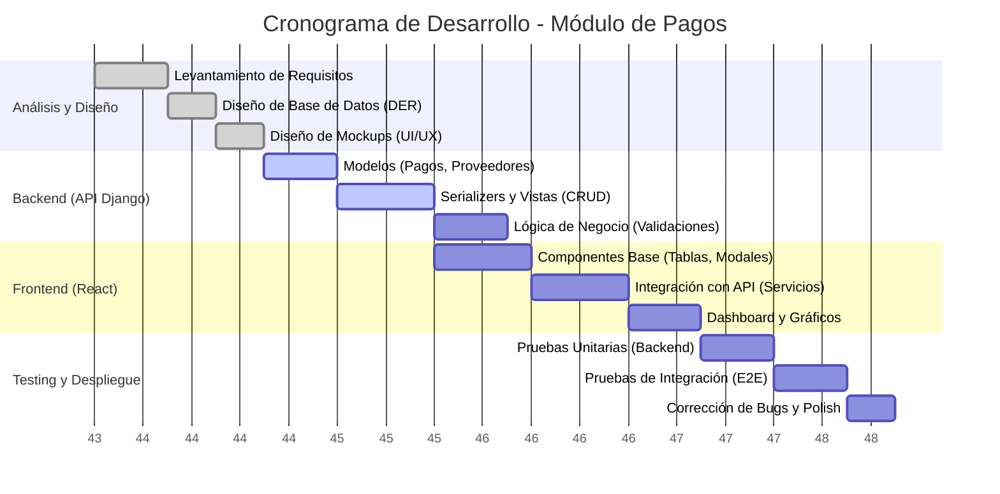
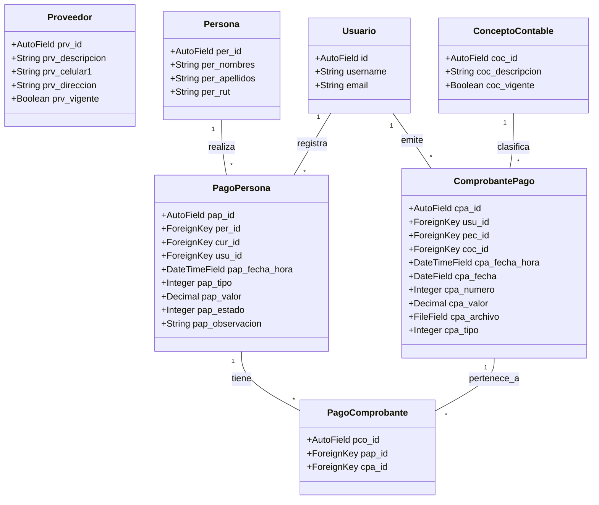

# Informe de Proyecto: Módulo de Pagos - Sistema GIC

**Asignatura:** Ingeniería de Software  
**Institución:** INACAP  
**Fecha:** Diciembre 2025  

---

## INDICE

1. [Portada](#portada)
2. [Introducción del Proyecto](#introducción-del-proyecto)
3. [Desarrollo](#desarrollo)
    * [Carta Gantt del Proyecto](#carta-gantt-del-proyecto)
    * [Diagrama de Clases](#diagrama-de-clases)
    * [Checklist del Testing y Estándares de Calidad](#checklist-del-testing-y-estándares-de-calidad)
    * [Mockups de Pantallas](#mockups-de-pantallas)
4. [Conclusión](#conclusión)

---

## 1. PORTADA

**Título del Proyecto:** Sistema de Gestión Integral (GIC) - Módulo Financiero  
**Integrantes del Equipo:**
* [Nombre Integrante 1]
* [Nombre Integrante 2]
* [Nombre Integrante 3]

**Docente:** [Nombre del Docente]  
**Sección:** [Número de Sección]

---

## 2. INTRODUCCIÓN DEL PROYECTO

El presente informe detalla el desarrollo del **Módulo de Pagos y Gestión Financiera** para el sistema GIC (Gestión Integral de Cursos). Este módulo es crítico para la administración de los recursos económicos de la organización, permitiendo el control detallado de ingresos (pagos de alumnos, subvenciones) y egresos (pagos a proveedores, gastos operativos).

El objetivo principal es digitalizar y automatizar el flujo de caja, proporcionando herramientas para:
*   Registro y seguimiento de pagos asociados a personas y cursos.
*   Gestión de proveedores y sus respectivos pagos.
*   Emisión y almacenamiento digital de comprobantes de pago.
*   Visualización de estadísticas financieras en tiempo real mediante un Dashboard interactivo.

Este módulo se integra con los subsistemas de Personas, Cursos y Maestros para asegurar la integridad referencial de los datos.

---

## 3. DESARROLLO

### Carta Gantt del Proyecto

A continuación se presenta la planificación temporal para el desarrollo del Módulo de Pagos, estimada en 4 semanas de trabajo intensivo.

### Diagrama de Clases

El siguiente diagrama representa la estructura de clases del modelo de datos implementado en el backend (Django), mostrando las relaciones entre Pagos, Comprobantes, Proveedores y las entidades base del sistema.

### Checklist del Testing y Estándares de Calidad

Para garantizar la robustez del módulo, se ha definido el siguiente checklist de pruebas funcionales y estándares de calidad.

#### Checklist de Pruebas Funcionales (QA)

| ID | Funcionalidad | Prueba Realizada | Resultado Esperado | Estado |
|----|---------------|------------------|--------------------|--------|
| **P01** | **Registro de Pagos** | Registrar un nuevo pago de ingreso asociado a un alumno. | El pago se guarda en BD y aparece en el listado. | ✅ Aprobado |
| **P02** | **Validación de Montos** | Intentar registrar un pago con monto negativo o cero. | El sistema muestra error y bloquea el guardado. | ✅ Aprobado |
| **P03** | **Gestión de Proveedores** | Crear, editar y eliminar (lógico) un proveedor. | Los cambios se reflejan en la lista de proveedores. | ✅ Aprobado |
| **P04** | **Búsqueda y Filtros** | Buscar pagos por nombre de persona o rango de fechas. | La tabla muestra solo los registros coincidentes. | ✅ Aprobado |
| **P05** | **Dashboard** | Verificar carga de gráficos de ingresos vs egresos. | Los gráficos muestran datos coherentes con la BD. | ✅ Aprobado |
| **P06** | **Pago Masivo** | Registrar un pago que cubre múltiples cuotas/conceptos. | Se generan múltiples registros o un registro consolidado correctamente. | ⚠️ Pendiente |
| **P07** | **Comprobantes** | Subir un archivo PDF/Imagen al crear un comprobante. | El archivo se almacena y es descargable. | ✅ Aprobado |

#### Estándares de Calidad

1.  **Código Limpio (Clean Code):**
    *   Uso de **PEP8** para el código Python (Backend).
    *   Uso de **ESLint** y Prettier para el código JavaScript/React (Frontend).
    *   Nombres de variables y funciones descriptivos en español/inglés consistente.

2.  **Arquitectura:**
    *   Separación clara de responsabilidades (MVC en Backend, Component-Based en Frontend).
    *   Uso de **DRF (Django Rest Framework)** para una API RESTful estandarizada.

3.  **Interfaz de Usuario (UI/UX):**
    *   Diseño **Responsive** (adaptable a móviles y escritorio) usando Tailwind CSS.
    *   Feedback visual al usuario (Toasts de éxito/error, Spinners de carga).
    *   Modo Oscuro (Dark Mode) nativo para reducir fatiga visual.

---

### Mockups de Pantallas

A continuación se describen las pantallas principales desarrolladas por el equipo para el Módulo de Pagos.

#### 1. Dashboard Financiero (`DashboardPagos.jsx`)
**Descripción:** Pantalla principal que ofrece una visión general del estado financiero.
*   **Elementos:**
    *   Tarjetas de Resumen (KPIs): Ingresos del Mes, Pagos Pendientes, Total Egresos.
    *   Gráfico de Líneas: Tendencia de ingresos vs egresos en los últimos 6 meses.
    *   Barra de Navegación Superior: Pestañas para acceder a las sub-secciones (Gestión, Proveedores, Comprobantes).

#### 2. Gestión de Pagos (`GestionPagos.jsx`)
**Descripción:** Interfaz operativa para el registro y consulta de transacciones.
*   **Elementos:**
    *   Tabla de Datos: Lista paginada de todos los pagos registrados con columnas (Fecha, Persona, Concepto, Monto, Estado).
    *   Buscador: Campo de texto para filtrar por RUT o Nombre.
    *   Botón "Nuevo Pago": Abre un modal formulario para ingresar los detalles de una nueva transacción.
    *   Acciones por Fila: Botones para Ver Detalle, Editar o Anular pago.

#### 3. Registro de Pago Masivo (`RegistrarPagoMasivoModal.jsx`)
**Descripción:** Formulario avanzado para registrar pagos complejos.
*   **Elementos:**
    *   Selección de Persona: Buscador con autocompletado.
    *   Grid de Conceptos: Lista de deudas/conceptos pendientes seleccionables (checkboxes).
    *   Resumen de Totales: Cálculo automático del total a pagar según la selección.
    *   Método de Pago: Selector (Efectivo, Transferencia, WebPay).

---

## 4. CONCLUSIÓN

El desarrollo del Módulo de Pagos para el sistema GIC ha permitido centralizar y ordenar la información financiera de la institución. La implementación de una arquitectura moderna (React + Django) facilita la escalabilidad y el mantenimiento futuro.

A través de las pruebas realizadas, se ha verificado que el sistema cumple con los requerimientos funcionales críticos: registro fidedigno de transacciones, gestión de entidades externas (proveedores) y generación de reportes visuales para la toma de decisiones. Aunque funcionalidades avanzadas como el "Pago Masivo" requieren pruebas adicionales, la base del sistema es sólida y cumple con los estándares de calidad exigidos por la asignatura.
