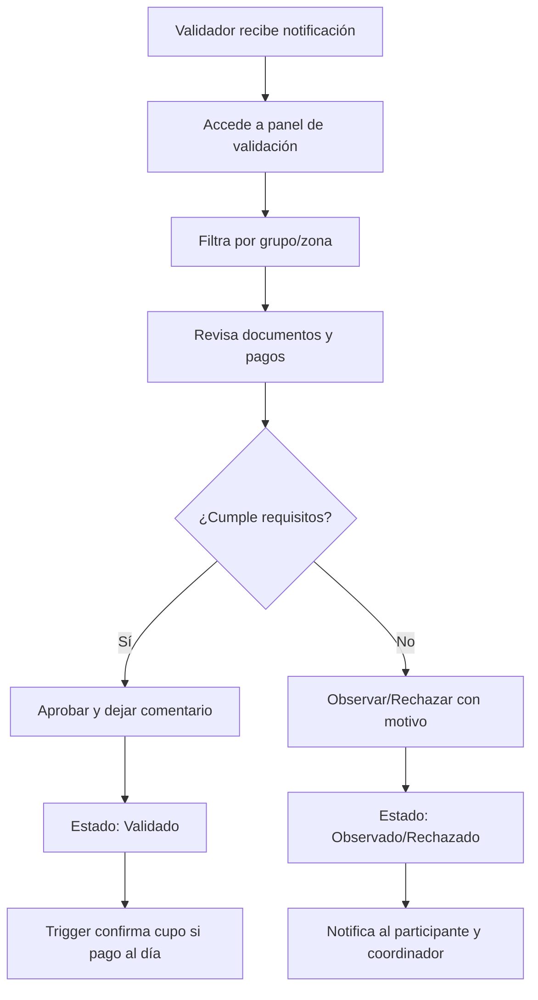
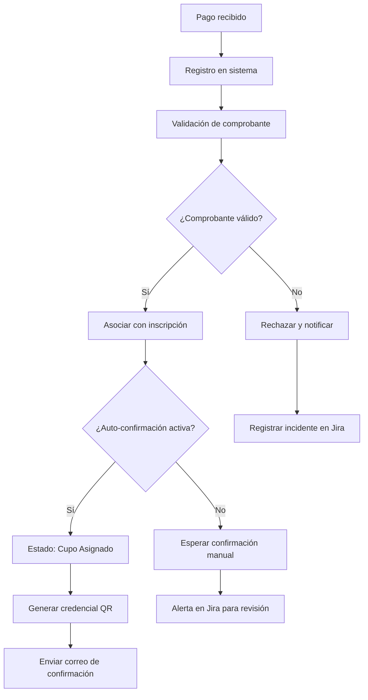

# Análisis Completo del Proyecto Sistema Scout

## 1. Estado Actual del Proyecto

### 1.1 Sprint Backlog Prioritario (Semana del 29/09/2025)

| # | Tarea | Responsables | Prioridad | Estado | Fecha objetivo |
|---|-------|--------------|-----------|--------|----------------|
| 1 | Plan y script de migración (inventario XLSM) | Jose Camilo Colivoro, Nicolás González | Importante | En curso | 15/09/2025 |
| 2 | Prototipo UX: Landing + Hero + CTA | Ricardo, Rodrigo, Marisol, Lucas, Giovani | Media |  Completado | 13/09/2025 |
| 3 | Definir metodología y plan de sprints | Ricardo, Giovani | Media | ✅ Completado | 14/09/2025 |
| 4 | Prototipo UX: Wizard de preinscripción | Leonardo, Juan Luis, Miguel | Media | ✅ Completado | 14/09/2025 |
| 5 | Modelo de datos preliminar (ERD) | Nicolás, Josué, Lucas | Urgente |  En curso (vencido 10/09/2025) | 10/09/2025 |

### 1.2 Observaciones Clave

- **Fortalezas:** Documentación extensa, decisiones tecnológicas consensuadas, equipo multidisciplinario distribuido en 6 módulos.
- **Riesgos activos:** ERD vencido, migración XLSM sin completar, falta de checklist operativo por tarea.
- **Oportunidades:** Integrar SonarQube y Jira en flujo diario, reutilizar prototipos UX ya aprobados, aprovechar scripts de automatización propuestos en DevOps.

## 2. Diagnóstico Estratégico

- **Cobertura funcional:** 7 flujos principales (preinscripción, pagos, validaciones, acreditación, reportes, notificaciones, documentación).
- **Equipo:** 14 desarrolladores distribuidos en módulos especializados (DevOps, Autenticación, UI, Formularios, Finanzas, QA).
- **Objetivo inmediato:** Consolidar modelo de datos en Microsoft SQL Server y asegurar trazabilidad con SonarQube + Jira antes de iniciar Sprint 3.

## 3. Arquitectura Técnica Objetivo

### 3.1 Vista de Capas

```
┌──────────────────────────────────────┐
│ Capa de Presentación                │  Vue 3 + Vite + Tailwind + Pinia     │
└──────────────────────────────────────┘
                                │ HTTPS / JWT
┌──────────────────────────────────────┐
│ Capa de API (Django REST Framework)  │  DRF, SimpleJWT, throttling, ACL    │
└──────────────────────────────────────┘
                                │ Internal services (Celery, webhooks)
┌──────────────────────────────────────┐
│ Servicios de Negocio                 │  Validaciones, pagos, reporting     │
└──────────────────────────────────────┘
                                │ ODBC / ORM / Redis
┌──────────────────────────────────────┐
│ Capa de Datos                        │  Microsoft SQL Server + Redis + S3  │
└──────────────────────────────────────┘
                                │ Observabilidad y QA
┌──────────────────────────────────────┐
│ Gestión y Calidad                    │  SonarQube, Jira, Prometheus/Grafana│
└──────────────────────────────────────┘
```

### 3.2 Stack Tecnológico Consolidado

- **Frontend:** Vue 3 + TypeScript, Vite, Tailwind CSS, Pinia, Vue Router, Vee-Validate.
- **Backend:** Django 4.2, DRF, SimpleJWT, Celery + Redis para tareas asíncronas.
- **Datos:** Microsoft SQL Server 2019 (modelo PDG), Redis 7, MinIO/S3, almacenamiento encriptado.
- **DevOps y Calidad:** Docker Compose, GitHub Actions, SonarQube (Quality Gate), Jira Software (automations), Prometheus + Grafana.
- **Seguridad:** JWT con rotación de refresh tokens, Rate limiting, auditoría completa, Always Encrypted en columnas sensibles.

### 3.3 Integraciones Clave

- **SonarQube:** análisis obligatorio en cada push a `develop`, Quality Gate (cobertura ≥80%, deuda técnica <5%, 0 vulnerabilidades críticas).
- **Jira Software:** nomenclatura de ramas `feature/PROY-###`, despliegues registrados vía Jira Deployments API, tableros automatizados con estados “Ready for QA”, “Ready for Deploy”.
- **Observabilidad:** métricas expuestas (`/metrics`) para backend y SQL Server, alertas en Discord/Slack, health checks (`/healthz`, `/readyz`).

## 4. Arquitectura y Modelo de Datos

### 4.1 Dominios Funcionales

- **Core Operacional:** cursos, preinscripciones, cupos por rama, acreditación.
- **Finanzas:** pagos individuales y masivos, conciliación bancaria, comprobantes, cuotas.
- **Personas y Documentos:** perfiles únicos, documentos de salud, historial de validaciones.
- **Comunicación:** notificaciones automáticas, campañas masivas, logs de envío.
- **Gobernanza:** auditoría, configuración, migraciones y reportes ejecutivos.

### 4.2 Entidades Principales

| Entidad | Propósito | Columnas clave | Observaciones |
| --- | --- | --- | --- |
| `app_user` | Usuarios internos y staff | `id`, `username`, `email`, `date_joined` | Autenticación Django, preparado para SSO futuro. |
| `role` / `user_role` | RBAC extendido | `role.name`, `user_role.user_id` | Permite vigencias (`expires_at`) y permisos JSON. |
| `curso` | Maestro de cursos | `codigo`, `zona`, `estado`, `configuracion` | Configuración JSON (cupos, reglas). |
| `cupo_configuracion` | Cupos por rol/rama | `rol`, `rama`, `cupo_total` | Validaciones T-SQL para sobreasignación. |
| `persona` | Participantes | `rut`, `zona`, `rama` | Campos sensibles con Always Encrypted. |
| `inscripcion` | Flujo de estado | `estado`, `cupo_asignado`, `habilitado_por` | Historial en `inscripcion_estado_log`. |
| `pago` / `pago_batch` | Gestión financiera | `monto`, `estado`, `pago_batch_id` | Importación masiva XLSX con conciliación. |
| `comprobante` | Evidencia de pago | `estado_validacion`, `archivo_path` | Almacenado en MinIO con hash SHA-256. |
| `cuota` | Seguimiento de cuotas | `numero`, `fecha_vencimiento`, `estado` | Generación automática por curso. |
| `persona_documento` | Archivos críticos | `tipo_documento`, `estado_validacion` | Versionado y control de acceso. |
| `acreditacion` | Control en terreno | `codigo_qr`, `estado`, `fecha_acreditacion` | Sync offline con lector QR móvil. |

### 4.3 Ejemplo de Definición Física (SQL Server)

```sql
CREATE TABLE [dbo].[curso] (
    [id]                INT IDENTITY(1,1)    NOT NULL PRIMARY KEY,
    [codigo]            VARCHAR(50)          NOT NULL UNIQUE,
    [nombre]            VARCHAR(200)         NOT NULL,
    [descripcion]       NVARCHAR(MAX)        NULL,
    [zona]              VARCHAR(100)         NOT NULL,
    [lugar]             VARCHAR(200)         NULL,
    [fecha_inicio]      DATE                 NOT NULL,
    [fecha_fin]         DATE                 NOT NULL,
    [fecha_inscripcion_inicio] DATE          NULL,
    [fecha_inscripcion_fin]   DATE           NULL,
    [capacidad_total]   INT                  NOT NULL,
    [estado]            VARCHAR(20)          NOT NULL DEFAULT ('planificado'),
    [configuracion]     NVARCHAR(MAX)        NULL CHECK (configuracion IS NULL OR ISJSON(configuracion) = 1),
    [notas]             NVARCHAR(MAX)        NULL,
    [created_by]        INT                  NULL,
    [created_at]        DATETIME2            NOT NULL DEFAULT (SYSUTCDATETIME()),
    [updated_at]        DATETIME2            NOT NULL DEFAULT (SYSUTCDATETIME())
);
GO

ALTER TABLE [dbo].[curso]
    ADD CONSTRAINT [FK_curso_created_by_user]
    FOREIGN KEY ([created_by]) REFERENCES [dbo].[app_user]([id]);
GO
```

Los scripts completos se almacenan en `database/schema/mssql` y se sincronizan desde el modelo SAP PowerDesigner (`SGICS_Modelo.pdg`).

### 4.4 Relaciones y Auditoría

- Claves foráneas con `ON DELETE CASCADE` entre `curso → inscripcion`, `inscripcion → pago`, `persona → inscripcion`.
- Tablas de log (`inscripcion_estado_log`, `comunicacion_log`, `audit_log`) con columnas `NVARCHAR(MAX)` y validación `CHECK (ISJSON(...)=1)`.
- Procedimientos `sp_registrar_auditoria`, `sp_actualizar_estado_inscripcion` encapsulan cambios críticos y persistencia de metadatos.
- SQL Server Agent programa backups diferenciales diarios y `DBCC CHECKDB` semanal.

### 4.5 Índices Recomendados

```sql
CREATE NONCLUSTERED INDEX IX_persona_rut ON dbo.persona (rut);
CREATE NONCLUSTERED INDEX IX_inscripcion_persona_curso ON dbo.inscripcion (persona_id, curso_id);
CREATE NONCLUSTERED INDEX IX_inscripcion_estado ON dbo.inscripcion (estado) INCLUDE (curso_id, updated_at);
CREATE NONCLUSTERED INDEX IX_pago_inscripcion ON dbo.pago (inscripcion_id);
CREATE NONCLUSTERED INDEX IX_comprobante_estado ON dbo.comprobante (estado_validacion, pago_id);
CREATE NONCLUSTERED INDEX IX_audit_log_entidad ON dbo.audit_log (entidad, entidad_id, timestamp DESC);
```

### 4.6 Triggers y Procedimientos Clave

```sql
GO
CREATE OR ALTER TRIGGER trg_inscripcion_updated_at
ON dbo.inscripcion
AFTER UPDATE
AS
BEGIN
    SET NOCOUNT ON;
    UPDATE i
        SET updated_at = SYSUTCDATETIME()
    FROM dbo.inscripcion i
    INNER JOIN inserted ins ON i.id = ins.id;
END;
GO

CREATE OR ALTER TRIGGER trg_inscripcion_estado_log
ON dbo.inscripcion
AFTER UPDATE
AS
BEGIN
    SET NOCOUNT ON;
    INSERT INTO dbo.inscripcion_estado_log (inscripcion_id, estado_codigo, cambiado_por, comentarios, metadata)
    SELECT ins.id, ins.estado, ins.habilitado_por, 'Cambio automático de estado', JSON_OBJECT('source','trigger')
    FROM inserted ins
    INNER JOIN deleted del ON ins.id = del.id
    WHERE ins.estado <> del.estado;
END;
GO
```

### 4.7 Observabilidad de Datos

- Métricas de base de datos via `sqlserver_exporter` para Prometheus.
- Dashboards Grafana con tiempos de respuesta, crecimiento de tablas y éxito de jobs.
- Alertas por Slack/Discord cuando `IX_*` exceden el 80% de fragmentación o la cola de pagos supera 15 minutos.

## 5. Flujos de Proceso Clave

### 5.1 Preinscripción

```mermaid
graph TD
        A[Participante accede al formulario] --> B{¿Formulario activo?}
        B -->|No| C[Mostrar mensaje de inactivo]
        B -->|Sí| D[Completar datos personales]
        D --> E[Validar RUT y autocompletar]
        E --> F{¿RUT válido?}
        F -->|No| G[Mostrar error de RUT]
        F -->|Sí| H[Completar datos scout]
        H --> I[Adjuntar ficha médica]
        I --> J{¿Archivo válido?}
        J -->|No| K[Mostrar error de archivo]
        J -->|Sí| L[Revisar resumen]
        L --> M[Enviar preinscripción]
        M --> N[Estado: Enviado]
        N --> O[Notificar a validadores (Jira Automation)]
```

### 5.2 Validación Territorial y Documental



### 5.3 Pagos y Confirmación Automática



## 6. Plan de Migración a SQL Server

### 6.1 Fase 1 – Preparación (Sprint 1)

- Profiling de archivos XLSM y planillas auxiliares.
- Generación de scripts BCP + procedimientos almacenados parametrizados.
- Validación de integridad y normalización de claves territoriales.
- Backup completo de fuentes originales.

### 6.2 Fase 2 – Migración Controlada (Sprint 6)

- Carga de catálogos maestros (zonas, distritos, cursos) en esquema `dbo`.
- Importación de participantes y pagos históricos con transacciones por lote.
- Conciliación automática con reporte de diferencias.
- Verificación referencial (`FOREIGN_KEY_CHECKS` equivalentes en SQL Server).

### 6.3 Fase 3 – Validación y Rollback

- Comparación por muestreo contra planillas origen.
- Ejecución de `DBCC CHECKCONSTRAINTS` y pruebas de reportes.
- Documentación de manual de rollback, ventana de reversa 24h.
- Habilitación de monitoreo SonarQube/Jira para seguimiento de historias migratorias.

## 7. Plan de Acción Inmediato

### 7.1 Tareas Críticas (Semana actual)

1. **Normalizar ERD definitivo en PowerDesigner** – responsables: Nicolás, Josué, Lucas.
2. **Finalizar scripts de migración XLSM → SQL Server** – responsables: Jose Camilo, Nicolás.
3. **Implementar checklist operativo por módulo en Jira** – responsable: Ricardo.

### 7.2 Seguimiento Próxima Semana

- Configurar repositorio monorepo (`backend/`, `frontend/`, `infra/`).
- Implementar autenticación JWT + refresh tokens.
- Construir endpoints base (cursos, inscripciones, pagos) y pruebas unitarias.
- Configurar pipeline GitHub Actions con etapas `lint`, `pytest`, `vitest`, `sonar`. 

## 8. Métricas de Éxito

### 8.1 Técnicas

- Cobertura de pruebas backend ≥ 85%, frontend ≥ 70% (Vitest + Sonar).
- Tiempo de respuesta < 2 s para 95% de requests en ambiente staging.
- Disponibilidad objetivo 99.5% mensual.
- 0 vulnerabilidades críticas en análisis SonarQube.

### 8.2 Funcionales

- 100% de preinscripciones procesadas con validación territorial documentada.
- ≥90% de pagos conciliados automáticamente en menos de 24 h.
- Dashboards de cursos con semáforo operativo (verde/amarillo/rojo) en tiempo real.
- Reportes financieros y logísticos exportables (Excel/PDF) sin intervención manual.

### 8.3 Gobernanza y Proyecto

- 100% de commits y PR con referencia Jira (`PROY-###`).
- Tiempo medio de revisión de PR < 24 h.
- Incidentes críticos resueltos < 4 h.
- Satisfacción de equipo > 4/5 en retrospectivas.

## 9. Próximos Pasos

- Validar ERD definitivo con stakeholders y publicar versión `v1.0` en repositorio.
- Cargar SonarQube y Jira con reglas personalizadas para SGICS (naming, coverage, workflow).
- Preparar Sprint 3 backlog con foco en primer incremento funcional (preinscripción end-to-end).
- Coordinar sesión técnica de handover para frontend (Vue 3 + Vite) y backend (Django) con manual técnico actualizado.

## 10. Referencias y Artefactos Relacionados

- `02_ARQUITECTURA_DATOS/ARQUITECTURA_SOLUCION.md` – blueprint de datos y observabilidad.
- `07_DOCUMENTACION_TECNICA/MANUAL_TECNICO_SCOUTS.md` – manual de instalación y despliegue.
- `GUIA_TECNOLOGIAS_POR_MODULO.md` – tecnologías por módulo con dependencias.
- `DRS_COMPLETO_SCOUTS.md` – requerimientos funcionales y no funcionales actualizados.
- `database/schema/mssql/` – scripts T-SQL versionados.

---

**Fecha de actualización:** 01-10-2025

