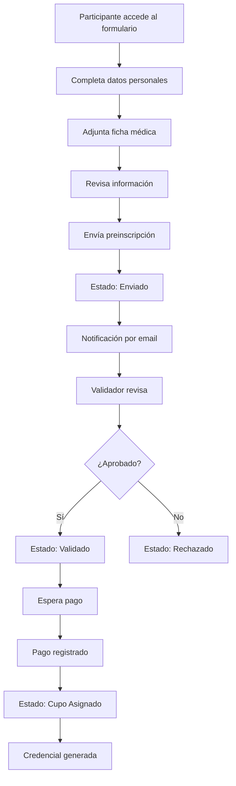
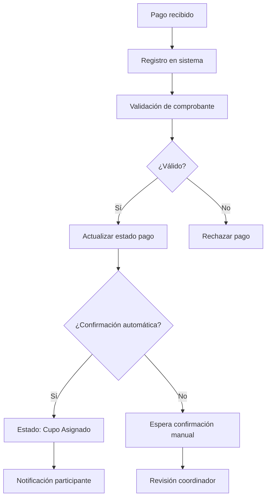
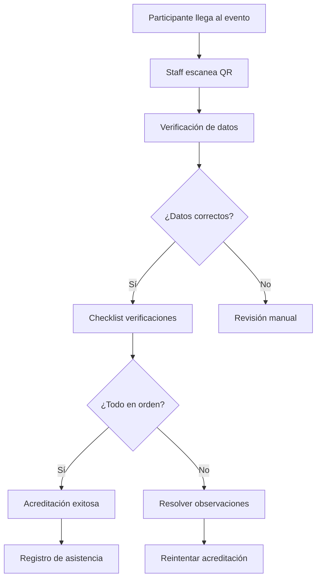

# Documento de Requerimientos de Software (DRS)

## Sistema de Gestión Integral para Cursos Scouts (SGICS)
 
**Proyecto:** Curso Medio 2025 - Zona Bío-Bío  
**Cliente:** Asociación de Guías y Scouts de Chile

---

## 1. Introducción

### 1.1 Propósito

Este documento define los requerimientos funcionales y no funcionales para el desarrollo del Sistema de Gestión Integral para Cursos Scouts (SGICS), una plataforma web que digitalizará y centralizará los procesos de gestión de cursos y eventos scouts.

### 1.2 Alcance

El sistema reemplazará los procesos manuales actuales basados en planillas Excel y documentos Word, implementando un flujo digital completo desde la preinscripción hasta la acreditación y generación de reportes.

### 1.3 Objetivos

- Digitalizar y centralizar procesos de gestión scout
- Reducir errores en validación de datos en 80%
- Optimizar tiempos de gestión y validación
- Garantizar trazabilidad y control de información
- Mejorar experiencia de usuarios (participantes y administradores)

### 1.4 Tecnologías y Plataformas Requeridas

- **Backend:** Django 4.2 + Django REST Framework desplegado sobre contenedores Docker.
- **Frontend:** SPA en Vue 3 con TypeScript y bundler Vite.
- **Base de Datos:** Microsoft SQL Server 2019, modelo físico sincronizado con el artefacto SAP PowerDesigner (`*.pdg`).
- **Cache y Mensajería:** Redis 7 para sesiones y colas de trabajo.
- **Calidad Continua:** SonarQube Community Edition con Quality Gate obligatorio (cobertura >80%, deuda técnica controlada).
- **Gestión Ágil:** Jira Software Cloud para planificación, seguimiento de issues y automatizaciones de despliegue.
- **Observabilidad:** Prometheus + Grafana, más health checks expuestos (`/healthz`, `/readyz`).
- **CI/CD:** GitHub Actions integrado con SonarQube y notificaciones automáticas hacia Jira.

---

## 2. Requerimientos Funcionales (RF)

### 2.1 Gestión de Usuarios y Autenticación

#### RF-01: Sistema de Autenticación

**Descripción:** El sistema debe permitir autenticación segura de usuarios mediante JWT.

**Criterios de Aceptación:**

- Login con email/username y contraseña
- Generación de tokens JWT con expiración
- Refresh token para renovación automática
- Logout seguro invalidando tokens
- Recuperación de contraseña por email

#### RF-02: Gestión de Roles y Permisos (RBAC)

**Descripción:** El sistema debe implementar un sistema de roles con permisos específicos.

**Roles Definidos:**

- **Superadmin:** Acceso total al sistema
- **Coordinador:** Gestión de cursos y validaciones
- **Validador Grupo:** Validación de participantes de su grupo
- **Validador Distrito:** Validación de participantes de su distrito
- **Finanzas:** Gestión de pagos y reportes financieros
- **Participante:** Acceso a su información y preinscripción

**Criterios de Aceptación:**

- Asignación de roles por administrador
- Control de acceso basado en roles
- Auditoría de cambios de permisos
- Middleware de autorización en todas las rutas

### 2.2 Gestión de Cursos

#### RF-03: Creación y Configuración de Cursos

**Descripción:** El coordinador debe poder crear y configurar cursos.

**Criterios de Aceptación:**

- Formulario de creación con campos: nombre, zona, lugar, fechas, capacidad
- Configuración de cupos por rol y rama
- Estados: Planificado, Activo, Finalizado, Cancelado
- Duplicación de cursos existentes
- Notas y observaciones por curso

#### RF-04: Habilitación de Preinscripciones

**Descripción:** El coordinador debe poder habilitar/deshabilitar preinscripciones por curso.

**Criterios de Aceptación:**

- Toggle para activar/desactivar formulario público
- Fechas de inicio y fin de preinscripciones
- Control de cupos disponibles
- Notificación automática de apertura/cierre

### 2.3 Preinscripción de Participantes

#### RF-05: Formulario de Preinscripción

**Descripción:** Los participantes deben poder preinscribirse mediante un formulario web.

**Campos del Formulario:**

- **Datos Personales:** Nombre completo, RUT, fecha nacimiento, sexo, teléfono, email
- **Ubicación:** Zona, distrito, grupo, rama
- **Salud:** Tipo alimentación, alergias, limitaciones físicas
- **Logística:** Vehículo (patente, marca, modelo, año)
- **Documentos:** Ficha médica (obligatoria)

**Criterios de Aceptación:**

- Validación automática de RUT
- Validación de formato de email y teléfono
- Campos condicionales según selecciones
- Carga obligatoria de ficha médica
- Confirmación por email al completar

#### RF-06: Gestión de Estados de Preinscripción

**Descripción:** El sistema debe manejar estados de preinscripción con flujo definido.

**Estados:**

1. **Borrador:** Preinscripción iniciada pero no enviada
2. **Enviado:** Preinscripción enviada, pendiente validación
3. **En Revisión:** En proceso de validación por grupo/distrito
4. **Validado:** Aprobado por validadores
5. **Cupo Asignado:** Confirmado con cupo disponible
6. **Rechazado:** No cumple criterios
7. **Cancelado:** Cancelado por participante

**Criterios de Aceptación:**

- Transiciones de estado controladas
- Log de cambios de estado con usuario y fecha
- Notificaciones automáticas por cambio de estado
- Posibilidad de revertir estados (con permisos)

### 2.4 Gestión de Pagos

#### RF-07: Registro de Pagos Individuales

**Descripción:** El equipo de finanzas debe poder registrar pagos individuales.

**Criterios de Aceptación:**

- Búsqueda de participante por RUT
- Registro de monto, fecha, método de pago
- Carga de comprobante de pago
- Asociación automática con preinscripción
- Actualización de estado de pago

#### RF-08: Importación de Pagos Grupales

**Descripción:** El sistema debe permitir importar pagos desde archivos CSV/XLSX.

**Criterios de Aceptación:**

- Subida de archivo con validación de formato
- Mapeo de columnas del archivo
- Preview de datos antes de importar
- Validación de RUTs y montos
- Reporte de errores y filas importadas
- Posibilidad de rollback de importación

#### RF-09: Gestión de Cuotas

**Descripción:** El sistema debe manejar cuotas de pago por participante.

**Criterios de Aceptación:**

- Generación automática de cuotas según curso
- Seguimiento de pagos por cuota
- Estados: Pendiente, Pagada, Vencida
- Notificaciones de vencimiento
- Reporte de morosidad

### 2.5 Validación y Aprobación

#### RF-10: Panel de Validadores

**Descripción:** Los validadores deben tener un panel para revisar preinscripciones.

**Criterios de Aceptación:**

- Lista filtrada por ámbito (grupo/distrito)
- Acciones: Aprobar, Observar, Rechazar
- Campo de comentarios obligatorio
- Notificación automática al participante
- Historial de validaciones

#### RF-11: Confirmación Automática por Pago

**Descripción:** El sistema debe confirmar automáticamente preinscripciones al recibir pago.

**Criterios de Aceptación:**

- Parámetro configurable por curso
- Activación automática al registrar pago válido
- Envío de email de confirmación
- Actualización de estado a "Cupo Asignado"
- Log de confirmación automática

### 2.6 Acreditación

#### RF-12: Generación de Códigos QR

**Descripción:** El sistema debe generar códigos QR únicos para cada participante.

**Criterios de Aceptación:**

- Código QR único por inscripción
- Información encriptada en el código
- Generación automática al confirmar inscripción
- Descarga de credencial con QR
- Validación de códigos en acreditación

#### RF-13: Panel de Acreditación

**Descripción:** El staff debe poder acreditar participantes el día del evento.

**Criterios de Aceptación:**

- Escaneo de código QR
- Verificación de datos del participante
- Checklist de verificaciones (documentos, pago, etc.)
- Registro de asistencia
- Reporte de acreditados

### 2.7 Reportes y Dashboards

#### RF-14: Dashboard Principal

**Descripción:** El sistema debe mostrar un dashboard con KPIs principales.

**Métricas Incluidas:**

- Total de preinscripciones
- Pagos recibidos vs pendientes
- Fichas médicas sin adjuntar
- Distribución por rama/distrito
- Estado de cupos por curso

**Criterios de Aceptación:**

- Actualización en tiempo real
- Filtros por fecha, curso, zona
- Gráficos interactivos
- Export a Excel/PDF

#### RF-15: Reportes Financieros

**Descripción:** El sistema debe generar reportes financieros detallados.

**Criterios de Aceptación:**

- Ingresos vs egresos por curso
- Reporte de morosidad
- Comprobantes de pago
- Export a Excel con formato contable
- Filtros por período y curso

#### RF-16: Reportes Logísticos

**Descripción:** El sistema debe generar reportes para logística del evento.

**Criterios de Aceptación:**

- Lista de participantes por alojamiento
- Requerimientos alimentarios especiales
- Vehículos registrados
- Información médica consolidada
- Export para equipos de logística

### 2.8 Comunicación

#### RF-17: Notificaciones Automáticas

**Descripción:** El sistema debe enviar notificaciones automáticas por email.

**Tipos de Notificaciones:**

- Confirmación de preinscripción
- Cambio de estado
- Recordatorio de pago
- Información del curso
- Credenciales de acceso

**Criterios de Aceptación:**

- Templates personalizables
- Envío automático según eventos
- Log de envíos con estado
- Posibilidad de envío manual
- Lista de exclusión

#### RF-18: Comunicación Masiva

**Descripción:** El sistema debe permitir envío de comunicaciones masivas.

**Criterios de Aceptación:**

- Selección de destinatarios por filtros
- Templates de mensaje
- Envío programado
- Seguimiento de entregas
- Log de comunicaciones

### RF-19: Eliminación de Landing Page y Registro Público
**Descripción:** El sistema debe redirigir directamente al dashboard tras autenticación, eliminando página de inicio y registro público.
**Criterios de Aceptación:**
- Ruta raíz (/) redirige a /dashboard
- Usuarios solo creados por administradores
- Eliminación de componentes Landing.vue y Register.vue

### RF-20: Dashboard con Semáforo de Cursos
**Descripción:** Dashboard debe mostrar estado visual de todos los cursos vigentes mediante sistema de semáforo.
**Criterios de Aceptación:**
- 🟢 Verde: Equipo completo + pagos al día + documentación completa
- 🟡 Amarillo: Equipo parcial O <20% pagos atrasados
- 🔴 Rojo: Falta equipo O ≥20% pagos atrasados O documentación incompleta
- Contador de participantes por curso
- Estado de pagos agregado (X/Y al día)
- Equipo del curso visible (formadores + coordinadores)

### RF-21: Cursos con Ramas y Calendario
**Descripción:** Sistema debe soportar subdivisiones de cursos por ramas y calendario de fechas importantes.
**Criterios de Aceptación:**
- Campo `rama`: Manada, Tropa, Comunidad, Rover, General
- Calendario integrado mostrando fechas clave
- Columna de acciones ampliada (modificar, cambiar estado, vigencia)
- Asignación rápida de responsables en creación

### RF-22: Módulo de Correos Masivos
**Descripción:** Sistema para envío de comunicaciones masivas a participantes de cursos.
**Criterios de Aceptación:**
- Selector de curso con carga automática de participantes
- Exportación de emails a archivo .txt
- Checklist de correos enviados
- Plantillas de correo predefinidas
- Envío masivo con confirmación
- Registro de envíos en base de datos

### RF-23: Búsqueda por RUT en Preinscripción
**Descripción:** Autocompletado de datos personales al ingresar RUT existente.
**Criterios de Aceptación:**
- Endpoint `/api/users/search-by-rut/`
- Autocompletado de campos si RUT existe
- Mensaje "Datos encontrados" o "Nuevo participante"
- Curso visible desde inicio del formulario

### RF-24: Gestión Avanzada de Pagos
**Descripción:** CRUD completo de pagos con búsqueda por grupo scout.
**Criterios de Aceptación:**
- Búsqueda de participantes por grupo
- Edición de pagos registrados
- Eliminación (soft delete) de pagos
- Visualización de participantes del grupo con estados de pago

### RF-25: Sistema de Notificaciones
**Descripción:** Notificaciones automáticas por eventos del sistema.
**Tipos de Notificaciones:**
- Modificaciones en cursos/participantes
- Pagos pendientes (3 días antes + vencidos)
- Cambios de estado de preinscripción
- Documentación faltante
**Criterios de Aceptación:**
- Campana de notificaciones en header
- Panel de historial completo
- Notificaciones push en navegador
- Emails automáticos configurables

### RF-26: Gestor de Archivos
**Descripción:** Sistema centralizado de gestión documental.
**Criterios de Aceptación:**
- Carga de archivos por participante/curso
- Organización por categorías (comprobantes, fichas médicas, etc.)
- Previsualización de archivos
- Control de versiones
- Búsqueda y filtrado
- Límites de tamaño y tipos permitidos

### RF-27: Búsquedas Avanzadas en Personas
**Descripción:** Filtros complejos para búsqueda de participantes.
**Filtros Disponibles:**
- Por grupo/patrulla
- Por zona geográfica
- Por rango de edad
- Por estado de membresía
- Por curso inscrito
- Por estado de documentación
**Criterios de Aceptación:**
- Combinación múltiple de filtros
- Exportación de resultados
- CRUD completo de personas

### RF-28: Acreditación con QR Personalizado
**Descripción:** Sistema de acreditación con códigos QR individuales.
**Criterios de Aceptación:**
- QR único por participante/curso
- Estado visual: 🟢 Acreditado / 🔴 Pendiente
- Verificación de pagos al día
- Verificación de documentación completa
- Escaneo desde dispositivos móviles
- Registro de timestamp de acreditación
- Panel de acreditaciones en tiempo real

---

## 3. Requerimientos No Funcionales (RNF)

### 3.1 Rendimiento

#### RNF-01: Tiempo de Respuesta

- **Criterio:** Tiempo de respuesta < 2 segundos para 95% de las operaciones
- **Medición:** Tiempo desde request hasta response completo
- **Ambiente:** Producción con carga normal

#### RNF-02: Capacidad de Usuarios Simultáneos

- **Criterio:** Soporte para 500 usuarios simultáneos
- **Medición:** Usuarios activos concurrentes
- **Ambiente:** Pico de preinscripciones

#### RNF-03: Disponibilidad

- **Criterio:** 99.5% de uptime mensual
- **Medición:** Tiempo de inactividad no planificado
- **Ambiente:** Producción 24/7

### 3.2 Seguridad

#### RNF-04: Protección de Datos Personales

- **Criterio:** Cumplimiento con Ley de Protección de Datos Personales
- **Implementación:**
  - Encriptación de datos sensibles
  - Acceso basado en roles
  - Auditoría de accesos
  - Backup seguro de datos

#### RNF-05: Autenticación Segura

- **Criterio:** Implementación de mejores prácticas de seguridad
- **Implementación:**
  - Tokens JWT con expiración
  - Contraseñas encriptadas
  - Rate limiting en endpoints
  - Validación de entrada

#### RNF-06: Confidencialidad de Información Médica

- **Criterio:** Acceso restringido a fichas médicas
- **Implementación:**
  - Permisos específicos para personal de salud
  - Encriptación de archivos médicos
  - Log de accesos a información sensible

### 3.3 Usabilidad

#### RNF-07: Interfaz Responsive

- **Criterio:** Funcionalidad completa en dispositivos móviles
- **Implementación:**
  - Diseño responsive
  - Optimización para touch
  - Carga rápida en móviles

#### RNF-08: Accesibilidad

- **Criterio:** Cumplimiento con estándares de accesibilidad web
- **Implementación:**
  - Contraste adecuado
  - Navegación por teclado
  - Textos alternativos en imágenes

### 3.4 Escalabilidad

#### RNF-09: Escalabilidad Horizontal

- **Criterio:** Capacidad de escalar agregando servidores
- **Implementación:**
  - Arquitectura stateless
  - Base de datos escalable
  - Load balancing

#### RNF-10: Escalabilidad de Datos

- **Criterio:** Manejo eficiente de grandes volúmenes de datos
- **Implementación:**
  - Índices optimizados
  - Paginación en listados
  - Archivo de datos históricos

### 3.5 Mantenibilidad

#### RNF-11: Código Documentado

- **Criterio:** Documentación completa del código
- **Implementación:**
  - Comentarios en código
  - Documentación de APIs
  - Manuales de usuario

#### RNF-12: Testing

- **Criterio:** Cobertura de tests > 80%
- **Implementación:**
  - Tests unitarios
  - Tests de integración
  - Tests de aceptación

#### RNF-13: Calidad Continua con SonarQube

- **Criterio:** Quality Gate obligatorio antes de permitir despliegues hacia ambientes `staging` o `production`.
- **Implementación:**
  - Pipeline GitHub Actions con etapas `lint`, `test`, `sonarcloud`.
  - Análisis SonarQube con métricas de vulnerabilidades, code smells y deuda técnica.
  - Umbrales mínimos: cobertura ≥ 80%, deuda técnica < 5%, vulnerabilidades bloqueantes = 0.

#### RNF-14: Trazabilidad mediante Jira Software

- **Criterio:** 100% de los cambios deben referenciar un issue Jira válido.
- **Implementación:**
  - Convención de ramas `feature/PROY-###-descripcion`.
  - Integración de despliegues a través de Jira Deployments API.
  - Automatización de transiciones de estado al aprobar Pull Requests y releases.

#### RNF-15: Observabilidad y Alertas

- **Criterio:** El sistema debe exponer métricas y health checks consumidos por Prometheus.
- **Implementación:**
  - Exporters configurados para backend (Django Prometheus) y SQL Server.
  - Dashboards en Grafana con alertas hacia Discord/Slack.
  - Log estructurado con correlación de requests.

---

## 4. Flujos de Proceso

### 4.1 Flujo de Preinscripción

### 4.2 Flujo de Validación de Pagos

### 4.3 Flujo de Acreditación

---

## 5. Modelo de Datos

### 5.1 Entidades Principales

#### Usuario (app_user)

- id, username, email, password_hash, role, full_name, is_active, created_at, last_login

#### Curso (curso)

- id, nombre, zona, lugar, fecha_inicio, fecha_fin, capacidad, estado, notas

#### Persona (persona)

- id, nombre_completo, rut, fecha_nacimiento, sexo, telefono, email, zona, grupo, rol_persona, alimentacion_tipo, alergias, limitacion_fisica, observaciones

#### Inscripción (inscripcion)

- id, persona_id, curso_id, fecha_inscripcion, estado, rama, grupo_asignado, cuota_asignada, habilitado_por, habilitado_fecha, confirmado_por_pago_id, en_lista_espera

#### Pago (pago)

- id, tipo, subtipo, fecha, monto, metodo_pago, estado, persona_id, curso_id, inscripcion_id, presupuesto_linea_id, pago_batch_id

#### Comprobante (comprobante)

- id, numero, tipo, fecha_emision, emisor, monto, estado_validacion, pago_id

### 5.2 Relaciones

- Usuario 1:N Audit_log
- Curso 1:N Inscripcion
- Persona 1:N Inscripcion
- Inscripcion 1:N Cuota
- Pago 1:N Comprobante
- Inscripcion 1:1 Acreditacion

### 5.3 Motor y Lineamientos de Datos

- **Motor Relacional:** Microsoft SQL Server 2019 en modalidad contenedorizada.
- **Modelo Canónico:** Archivo SAP PowerDesigner (`SGICS_Modelo.pdg`) como fuente de verdad para entidades, claves primarias (`PK_`) y foráneas (`FK_`).
- **Convenciones:**
  - Tipos `numeric(10)` para identificadores territoriales (REGIÓN, PROVINCIA, COMUNA).
  - Uso de `bit` para banderas de vigencia y `datetime2` para trazabilidad.
  - Esquema físico versionado en `database/schema/mssql` con scripts `DDL` generados desde PowerDesigner.
- **Mantenimiento:** Jobs automatizados de backups nocturnos y verificación de integridad (`DBCC CHECKDB`).
- **Seguridad:** Always Encrypted para campos sensibles (salud, credenciales) y encriptación en tránsito mediante `Encrypt=yes;TrustServerCertificate=yes`.

---

## 6. Plan de Migración

### 6.1 Inventario de Datos Actuales

#### Archivo: Curso Medio 2025_06.xlsm

**Hojas identificadas:**

- Participantes: Datos personales y de contacto
- Pagos: Registro de pagos y comprobantes
- Logística: Información de vehículos y alojamiento
- Salud: Fichas médicas y requerimientos especiales

#### Mapeo de Columnas:

- Excel.RUT → persona.rut
- Excel.Nombre → persona.nombre_completo
- Excel.Email → persona.email
- Excel.Telefono → persona.telefono
- Excel.Zona → persona.zona
- Excel.Grupo → persona.grupo

### 6.2 Estrategia de Migración

#### Fase 1: Preparación (Sprint 1)

- Análisis completo de archivos Excel
- Creación de scripts de migración hacia SQL Server (BCP + procedimientos almacenados)
- Validación de integridad de datos
- Backup completo de datos originales

#### Fase 2: Migración (Sprint 6)

- Importación de datos maestros (cursos, usuarios) al esquema `dbo`
- Migración de participantes mediante lotes transaccionales
- Importación de pagos históricos con conciliación automática
- Validación post-migración

#### Fase 3: Verificación (Sprint 6)

- Comparación de datos migrados vs originales
- Pruebas de integridad referencial
- Validación de reportes
- Ajustes finales

### 6.3 Plan de Rollback

- Backup completo antes de migración
- Procedimiento de restauración documentado
- Ventana de rollback definida (24 horas)
- Comunicación a stakeholders

---

## 7. Criterios de Aceptación Generales

### 7.1 Funcionalidad

- [ ] Todos los RF implementados y probados
- [ ] Flujos de proceso funcionando correctamente
- [ ] Integración entre módulos validada
- [ ] Reportes generando datos correctos

### 7.2 Calidad

- [ ] Cobertura de tests > 80%
- [ ] 0 bugs críticos en producción
- [ ] Documentación completa
- [ ] Código revisado y aprobado

### 7.3 Seguridad

- [ ] Auditoría de seguridad completada
- [ ] Datos encriptados correctamente
- [ ] Accesos controlados por roles
- [ ] Logs de auditoría funcionando

### 7.4 Rendimiento

- [ ] Tiempo de respuesta < 2 segundos
- [ ] Soporte para 500 usuarios simultáneos
- [ ] Disponibilidad > 99.5%
- [ ] Pruebas de carga exitosas

---

