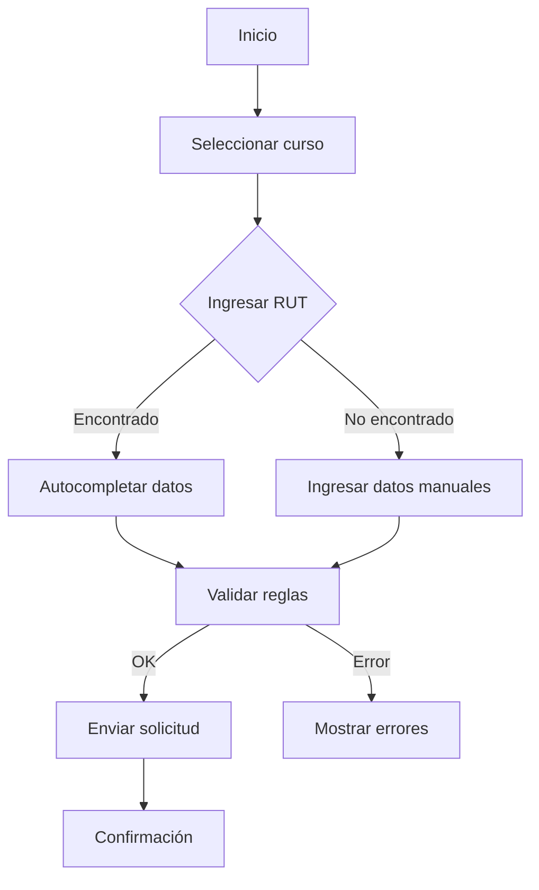
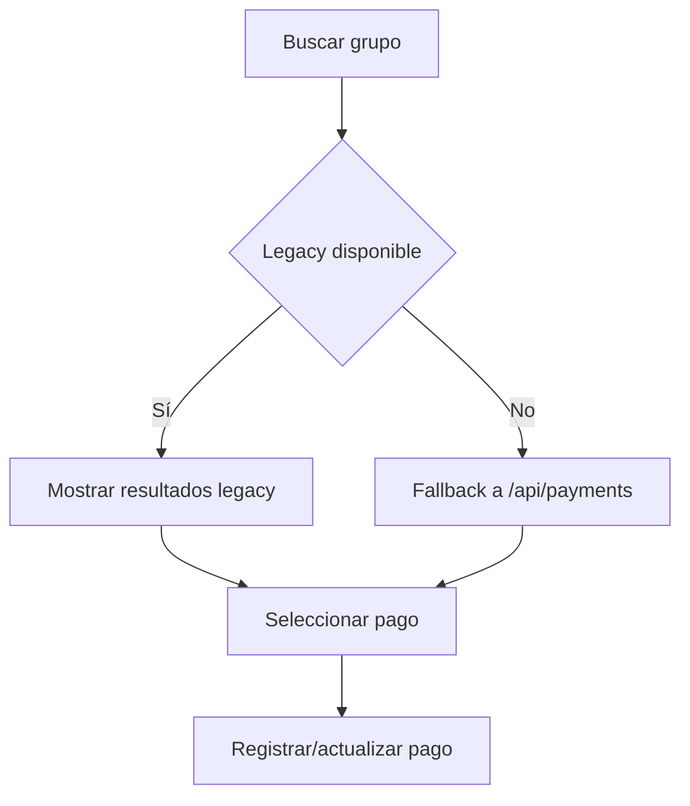
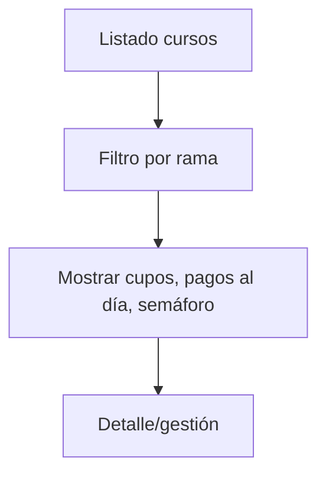
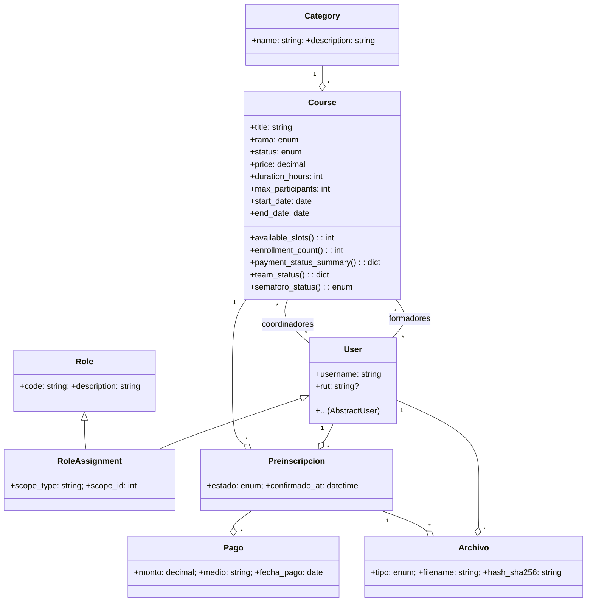
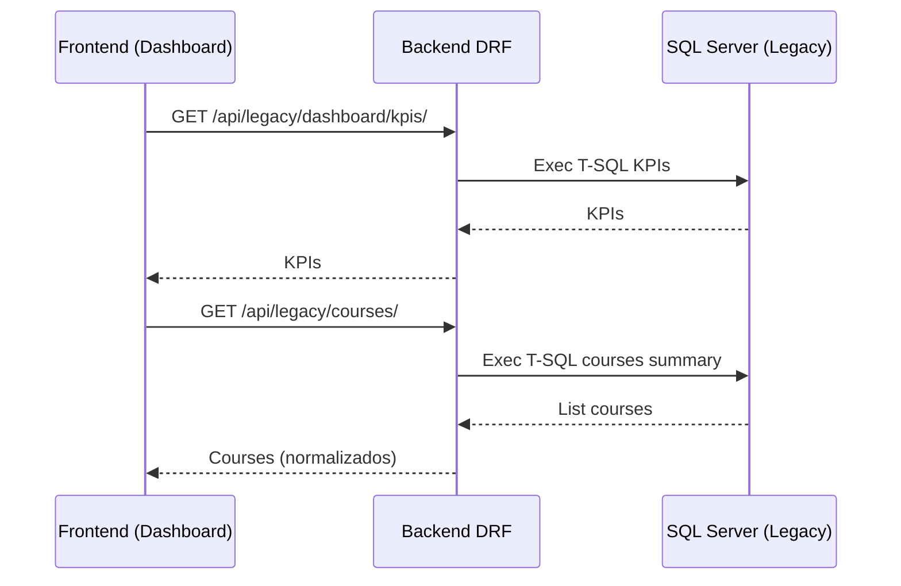
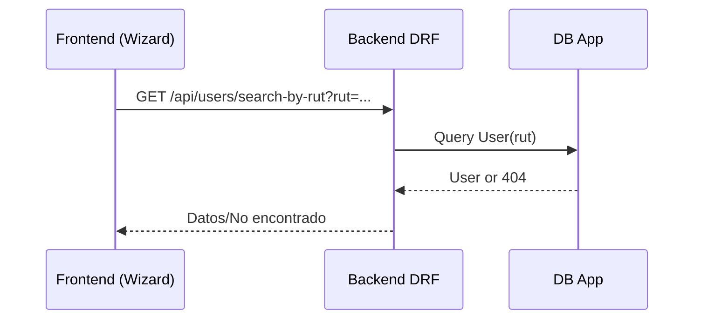
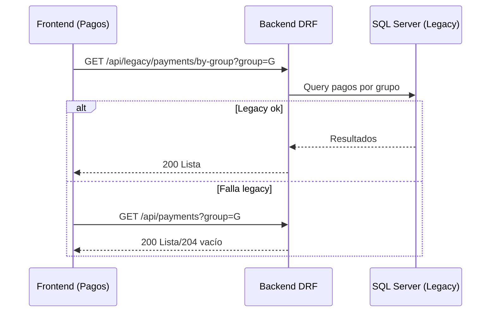

# INFORME OFICIAL DEL SISTEMA SGICS

Fecha: 02-10-2025  
Versión: 1.0 (Borrador para revisión)  
Responsable: Equipo de Proyecto SGICS

---

## 1. Toma de requerimientos
- Fuentes: reuniones con stakeholders (PO, equipos formadores, finanzas), documentación histórica en `docs/legacy/`, y artefactos del repositorio actual.
- Objetivo: consolidar una UI de 6 módulos con prioridad de datos del sistema legacy (SQL Server), preservando trazabilidad y pruebas.
- Alcances acordados:
  - Integración legacy-first vía endpoints `/api/legacy/*`.
  - Módulos: Dashboard, Cursos, Preinscripciones, Pagos, Archivos, Notificaciones.
  - Seguridad con JWT y rutas protegidas en frontend.

## 2. Análisis de la toma de requerimientos
- Conflictos resueltos: UI simplificada a 6 módulos; se elimina ruta pública de registro directo.
- Dependencias críticas: disponibilidad de SQL Server (esquema estable), agregados para KPIs y montos por curso.
- Riesgos mitigados: fallbacks en frontend (si falla legacy se usa DRF local), pruebas unitarias en backend/frontend.
- Gap identificado: “Recaudado real por curso” requiere agregado backend en MSSQL (hoy se usa estimado).

## 3. Requerimientos funcionales y no funcionales
- Ver documento `REQUERIMIENTOS_ACTUALIZADOS.md` (secciones RF y RNF) para el detalle y criterios de aceptación.

## 4. Planificación: Carta Gantt (alto nivel)

```mermaid
gantt
  title SGICS - Plan de Alto Nivel (14 semanas)
  dateFormat  YYYY-MM-DD
  axisFormat  %d-%m
  %% Inicio de proyecto: 01 Sept 2025
  %% Sprints de 2 semanas

  section Sprint 0 — Setup (01-09 al 14-09)
  Análisis y diseño inicial          :done,    a1, 2025-09-01, 2025-09-14
  Docker + SQL Server base           :done,    d1, 2025-09-01, 2025-09-10
  Hito: Ambiente listo               :milestone, m1, 2025-09-14, 0d

  section Sprint 1 — Fundamentos (15-09 al 28-09)
  Integración MSSQL (KPIs/Cursos)    :active,  a2, 2025-09-15, 2025-09-28
  Auth JWT + SonarQube en CI         :         s1, 2025-09-16, 2025-09-28
  Hito: Auth + Sonar OK               :milestone, m2, 2025-09-28, 0d

  section Sprint 2 — Base Técnica (29-09 al 12-10)
  Dashboard & Cursos (UI)            :active,  f1, 2025-09-29, 2025-10-12
  Esquema SQL estable                :         db1, 2025-09-29, 2025-10-12
  Hito: UI base + esquema            :milestone, m3, 2025-10-12, 0d

  section Sprint 3 — Lógica (13-10 al 26-10)
  Preinscripciones (Wizard + RUT)    :         f2, 2025-10-13, 2025-10-26
  Pagos (grupo + cuotas)             :         f3, 2025-10-13, 2025-10-26
  Recaudado real por curso (MSSQL)   :         b2, 2025-10-13, 2025-10-26
  Hito: Lógica central               :milestone, m4, 2025-10-26, 0d

  section Sprint 4 — Integración (27-10 al 09-11)
  Endpoints legacy adicionales       :         b1, 2025-10-27, 2025-11-09
  Flujo Pagos grupo (fallback)       :         p1, 2025-10-27, 2025-11-09
  Hito: Integración completa         :milestone, m5, 2025-11-09, 0d

  section Sprint 5 — UI/UX + Calidad (10-11 al 23-11)
  Archivos & Notificaciones (UI)     :         f4, 2025-11-10, 2025-11-23
  Pruebas E2E + performance          :         q1, 2025-11-10, 2025-11-23
  Hito: UI/UX final + gates          :milestone, m6, 2025-11-23, 0d

  section Sprint 6 — Cierre (24-11 al 07-12)
  Despliegue y observabilidad        :         dv1, 2025-11-24, 2025-12-07
  Runbook + handover                 :         op1, 2025-11-24, 2025-12-07
  Hito: Producción                   :milestone, m7, 2025-12-07, 0d
```

Notas:
- Fechas alineadas a 14 semanas, con 7 hitos bisemanales.
- Riesgos: agregado “recaudado real” y endpoints legacy adicionales.

## 5. Diagramas de actividades (por módulo)

### 5.1 Preinscripciones (Wizard con RUT)


### 5.2 Pagos (Búsqueda por grupo + registro)


### 5.3 Cursos (Listado + semáforo)


## 6. Diagrama de clases (dominio)



## 7. Diagramas de secuencia (flujos clave)

### 7.1 Dashboard carga inicial


### 7.2 Preinscripción con búsqueda por RUT


### 7.3 Pagos por grupo con fallback


## 8. Mockups (referencias visuales)
- Ver `docs/assets/diagramas y interfaces/` (Dashboard.png, cursos.jpg, NOTIFICACIONES1.png, Pre inscripcion wireframe.png, etc.).
- La navegación principal expone exactamente 6 módulos.

## 9. Conclusiones y próximos pasos
- La arquitectura y la UI implementan la estrategia legacy-first.
- Pendientes técnicos: agregado “recaudado real por curso” y endpoint legacy “pagos por grupo”.
- Recomendación: formalizar pruebas de contrato para `/api/legacy/*` y publicar una guía de despliegue.

## 10. Automatización de despliegue (CI/CD)

Decisión recomendada: GitHub Actions sobre Jenkins para este repositorio.

Motivos:
- Integración nativa con GitHub (PRs, ambientes efímeros, artefactos, ambientes protegidos).
- Menor coste operativo (sin mantener servidor Jenkins ni agentes Windows/Linux).
- Marketplace amplio (acciones para Node, Python, Docker, Sonar, Azure, etc.).

Pipeline propuesto (resumen):
- Triggers: push/PR a `main` y `release/*`.
- Jobs:
  - Lint + pruebas frontend (Node 20; Vitest).
  - Lint backend y pruebas unitarias mínimas (opcional si existen tests).
  - Build de imágenes Docker (frontend/backend) con etiquetas semver y `sha`.
  - SonarQube (si se dispone de token/servidor) como quality gate.
  - Despliegue: ambiente `staging` con aprobación manual; luego `prod`.

Despliegue por entorno (alternativas):
- Docker Compose en VM (Windows/Linux) con variables por entorno.
- Azure Web Apps + Azure SQL (si se decide nube Azure), o AKS si se requiere Kubernetes.

Siguiente paso: agregar workflows de ejemplo en `.github/workflows/` y un `README` de despliegue con variables requeridas y secretos (JWT_SECRET, DB strings, etc.).

---

Anexos: ver `ACTA_DE_DEFINICION_DEL_DOCUMENTO.md` y `REQUERIMIENTOS_ACTUALIZADOS.md`.
