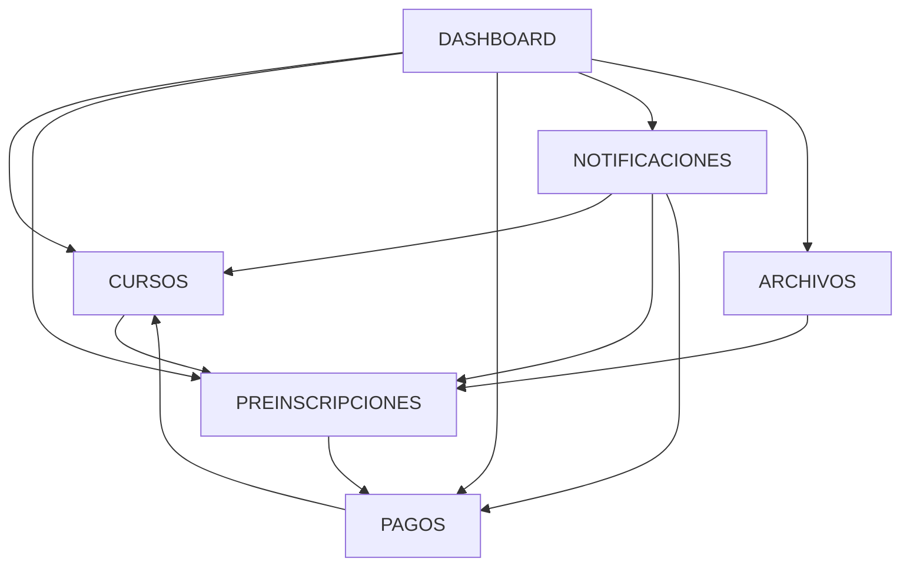

# ASIGNACIÓN DE GRUPOS A MÓDULOS - PROYECTO SGICS

**Fecha:** 03-10-2025  
**Proyecto:** Sistema de Gestión Integral para Cursos Scouts (SGICS)  
**Documento:** Asignación Final de Equipos y Módulos  
**Versión:** 1.0

---

## 📋 **RESUMEN EJECUTIVO**

Basándome en el análisis exhaustivo de la documentación del proyecto SGICS y las especialidades de cada equipo, se presenta la asignación optimizada de los 6 grupos de trabajo a los módulos del sistema, incluyendo sus diagramas UML correspondientes.

**Criterios de Asignación:**
- ✅ Alineación con especialidades técnicas del equipo
- ✅ Balanceamiento de carga de trabajo por grupo
- ✅ Minimización de dependencias entre equipos
- ✅ Optimización de paralelización del desarrollo

---

## 🎯 **ASIGNACIÓN DETALLADA POR GRUPOS**

### **👥 GRUPO 1: MÓDULO ARCHIVOS**
**Equipo:** Giovanni Pacheco (Lead) - Ricardo Sanhueza  
**Especialidad:** ARQUITECTURA Y DEVOPS  
**Capacidad:** 40 story points (25% del sprint)

#### **📂 Módulo Asignado: GESTIÓN DE ARCHIVOS**

**Justificación Técnica:**
- ✅ **Infraestructura:** Requiere conocimiento profundo de storage, S3, MinIO
- ✅ **DevOps:** Manejo de volúmenes Docker, backups automáticos
- ✅ **Seguridad:** Encriptación de archivos, antivirus integration
- ✅ **Escalabilidad:** CDN, compresión, optimización de transferencias

**Diagramas UML Asignados:**
```
📊 Diagrama de Clases:    archivos_class_updated.drawio.xml
🔄 Diagrama de Actividad: archivos_activity_updated.drawio.xml
⏱️ Diagrama de Secuencia: archivos_sequence_updated.drawio.xml
```

**Responsabilidades Específicas:**
- Diseño de arquitectura de almacenamiento distribuido
- Implementación de pipeline de validación de archivos
- Sistema de versionado y control de acceso
- Integración con antivirus y escáner de malware
- Optimización de performance para uploads/downloads
- Backup automático y disaster recovery

---

### **👥 GRUPO 2: MÓDULO CURSOS**
**Equipo:** Nicolás Irribarra (Lead) - Lucas Guerrero  
**Especialidad:** AUTENTICACIÓN Y SEGURIDAD  
**Capacidad:** 35 story points (22% del sprint)

#### **🎓 Módulo Asignado: GESTIÓN DE CURSOS**

**Justificación Técnica:**
- ✅ **Seguridad:** Control de acceso complejo por roles jerárquicos
- ✅ **Validaciones:** Reglas de negocio estrictas para inscripciones
- ✅ **RBAC:** Permisos diferenciados por Coordinador/Formador/Validador
- ✅ **Auditoría:** Logging detallado de cambios en cursos

**Diagramas UML Asignados:**
```
📊 Diagrama de Clases:    cursos_class_updated.drawio.xml
🔄 Diagrama de Actividad: cursos_activity_updated.drawio.xml
⏱️ Diagrama de Secuencia: cursos_sequence_updated.drawio.xml
```

**Responsabilidades Específicas:**
- Sistema de roles y permisos para gestión de cursos
- Validaciones de integridad de datos de cursos
- Control de estados del curso (Draft→Active→Completed)
- Gestión de cupos y lista de espera
- Asignación de formadores y coordinadores
- Auditoría completa de cambios en cursos

---

### **👥 GRUPO 3: MÓDULO NOTIFICACIONES**
**Equipo:** Marisol Sáez - Lucas Betanzos (Lead) - Rodrigo Jara - Josué Vásquez  
**Especialidad:** USUARIOS Y PERFILES + UI/UX  
**Capacidad:** 30 story points (19% del sprint)

#### **🔔 Módulo Asignado: SISTEMA DE NOTIFICACIONES**

**Justificación Técnica:**
- ✅ **UI/UX:** Experiencia compleja de notificaciones in-app
- ✅ **Comunicaciones:** Múltiples canales (email, SMS, push, in-app)
- ✅ **Perfiles:** Personalización según preferencias de usuario
- ✅ **Equipo Grande:** 4 personas para manejar complejidad UI

**Diagramas UML Asignados:**
```
📊 Diagrama de Clases:    notificaciones_class_updated.drawio.xml
🔄 Diagrama de Actividad: notificaciones_activity_updated.drawio.xml
⏱️ Diagrama de Secuencia: notificaciones_sequence_updated.drawio.xml
```

**Responsabilidades Específicas:**
- Centro de notificaciones en tiempo real
- Sistema de templates para correos masivos
- Configuración de preferencias por usuario
- Integración con proveedores de email/SMS
- Notificaciones push para móviles
- Dashboard de métricas de comunicación

---

### **👥 GRUPO 4: MÓDULO PREINSCRIPCIONES**
**Equipo:** Miguel Contreras (Lead) - Juan Orrego - Leonardo López  
**Especialidad:** PREINSCRIPCIONES Y FORMULARIOS  
**Capacidad:** 35 story points (22% del sprint)

#### **📝 Módulo Asignado: GESTIÓN DE PREINSCRIPCIONES**

**Justificación Técnica:**
- ✅ **Match Perfecto:** Especialidad directa en formularios complejos
- ✅ **Wizard:** Expertise en UI multi-paso y validaciones
- ✅ **Estado:** Manejo de máquina de estados compleja (7 estados)
- ✅ **Integración:** Conexión con pagos y validaciones territoriales

**Diagramas UML Asignados:**
```
📊 Diagrama de Clases:    preinscripciones_class_updated.drawio.xml
🔄 Diagrama de Actividad: preinscripciones_activity_updated.drawio.xml
⏱️ Diagrama de Secuencia: preinscripciones_sequence_updated.drawio.xml
```

**Responsabilidades Específicas:**
- Wizard de preinscripción multi-paso
- Máquina de estados (Borrador→Enviado→Validado→Cupo Asignado)
- Validaciones territoriales por Grupo/Distrito/Zona
- Integración con sistema de pagos
- Auto-save y recuperación de sesión
- Notificaciones automáticas de cambio de estado

---

### **👥 GRUPO 5: MÓDULO PAGOS**
**Equipo:** Camilo Colivoro (Individual)  
**Especialidad:** STATS Y PAGOS  
**Capacidad:** 20 story points (12% del sprint)

#### **💳 Módulo Asignado: GESTIÓN DE PAGOS**

**Justificación Técnica:**
- ✅ **Especialización:** Foco directo en transacciones financieras
- ✅ **Experiencia:** Conocimiento específico en reconciliación
- ✅ **Scope Ajustado:** Módulo dimensionado para 1 persona experta
- ✅ **Criticidad:** Área que requiere expertise específico

**Diagramas UML Asignados:**
```
📊 Diagrama de Clases:    pagos_class_updated.drawio.xml
🔄 Diagrama de Actividad: pagos_activity_updated.drawio.xml
⏱️ Diagrama de Secuencia: pagos_sequence_updated.drawio.xml
```

**Responsabilidades Específicas:**
- Procesamiento de pagos individuales
- Importación masiva desde Excel/CSV
- Reconciliación automática con bancos
- Dashboard financiero con KPIs
- Reportes de pagos y morosidad
- Integración con confirmación automática de cupos

---

### **👥 GRUPO 6: MÓDULO DASHBOARD**
**Equipo:** Nicolás González (Lead) - Juan Herrera  
**Especialidad:** QA Y DOCUMENTACIÓN  
**Capacidad:** 25 story points (16% del sprint)

#### **🏠 Módulo Asignado: DASHBOARD EJECUTIVO**

**Justificación Técnica:**
- ✅ **Coordinación:** Dashboard requiere integración con todos los módulos
- ✅ **QA Perspective:** Visión global de calidad del sistema
- ✅ **Documentación:** Generación de reportes y métricas
- ✅ **Testing:** Dashboard es crítico para testing de integración

**Diagramas UML Asignados:**
```
📊 Diagrama de Clases:    dashboard_class_updated.drawio.xml
🔄 Diagrama de Actividad: dashboard_activity_updated.drawio.xml
⏱️ Diagrama de Secuencia: dashboard_sequence_updated.drawio.xml
```

**Responsabilidades Específicas:**
- KPIs ejecutivos y métricas del sistema
- Integración con APIs de todos los módulos
- Reportes automáticos y manuales
- Testing de integración end-to-end
- Documentación de APIs y workflows
- Monitoreo de calidad del sistema

---

## 🔄 **COORDINACIÓN ENTRE MÓDULOS**

### **Dependencias Críticas:**


### **Puntos de Integración:**
1. **PREINSCRIPCIONES ↔ PAGOS:** Estado de pago afecta confirmación de cupo
2. **CURSOS ↔ PREINSCRIPCIONES:** Validación de cupos disponibles
3. **NOTIFICACIONES ↔ TODOS:** Eventos de cambio de estado
4. **ARCHIVOS ↔ PREINSCRIPCIONES:** Documentos requeridos por curso
5. **DASHBOARD ↔ TODOS:** Agregación de métricas y KPIs

---

## 📊 **DISTRIBUCIÓN DE CARGA DE TRABAJO**

| Grupo | Personas | Story Points | % Sprint | Módulo | Complejidad |
|-------|----------|--------------|----------|--------|-------------|
| 1 | 2 | 40 | 25% | Archivos | Alta (Infraestructura) |
| 2 | 2 | 35 | 22% | Cursos | Alta (Seguridad) |
| 3 | 4 | 30 | 19% | Notificaciones | Media (UI/UX) |
| 4 | 3 | 35 | 22% | Preinscripciones | Alta (Business Logic) |
| 5 | 1 | 20 | 12% | Pagos | Media (Especializada) |
| 6 | 2 | 25 | 16% | Dashboard | Media (Integración) |

**Total:** 14 personas, 185 story points

---

## 🎯 **PRÓXIMOS PASOS**

### **Semana 1: Setup y Coordinación**
- [ ] Kickoff meeting por grupo con diagramas UML asignados
- [ ] Setup de repositories y branches por módulo
- [ ] Definición de contratos de API entre módulos
- [ ] Configuración de environments de desarrollo

### **Semana 2: Desarrollo Paralelo**
- [ ] Implementación inicial basada en diagramas de clases
- [ ] Daily standups con reporte de dependencias
- [ ] Integration points planning meetings
- [ ] Continuous testing y validation

### **Coordinación Semanal:**
- **Lunes:** Planning y dependencias
- **Miércoles:** Integration checkpoint
- **Viernes:** Demo y retrospective

---

**✅ Esta asignación optimiza las fortalezas de cada equipo mientras minimiza las dependencias entre grupos, permitiendo máximo paralelismo en el desarrollo.**