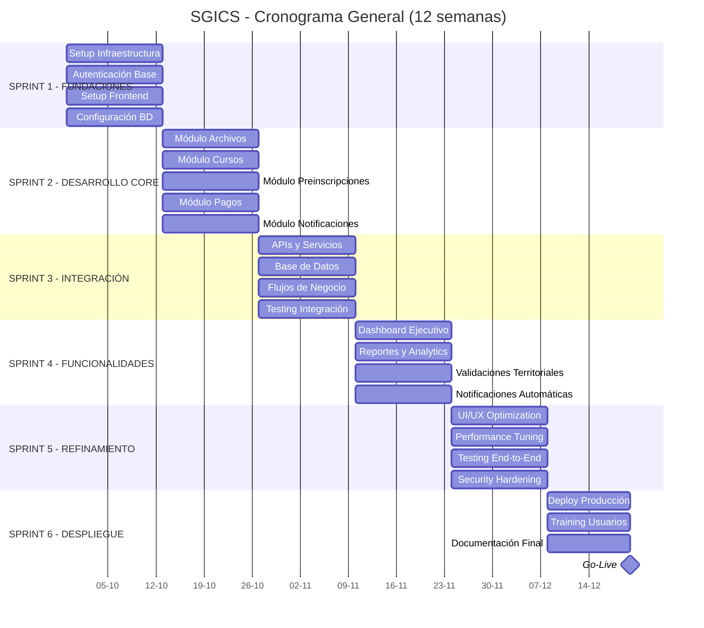
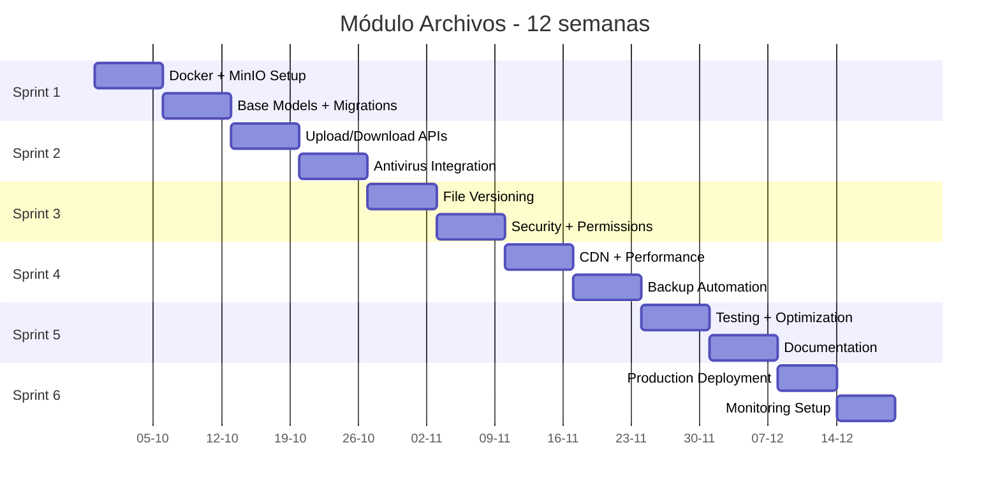
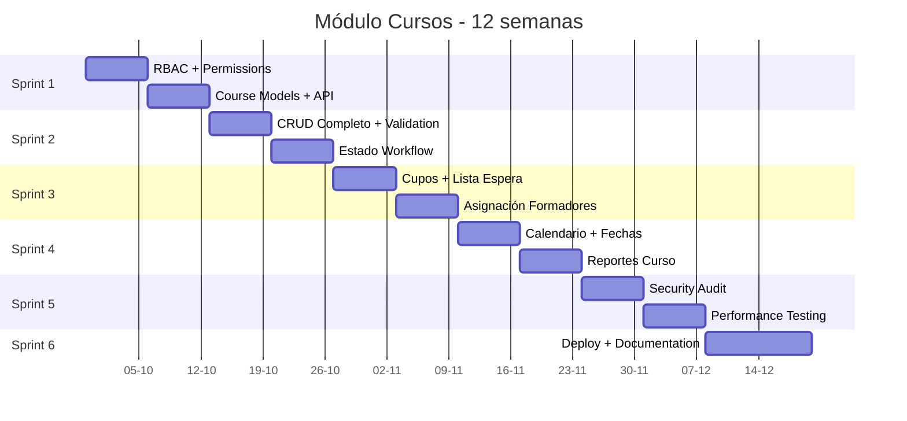
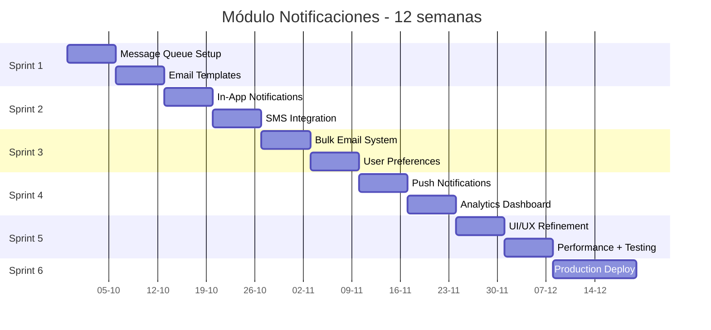
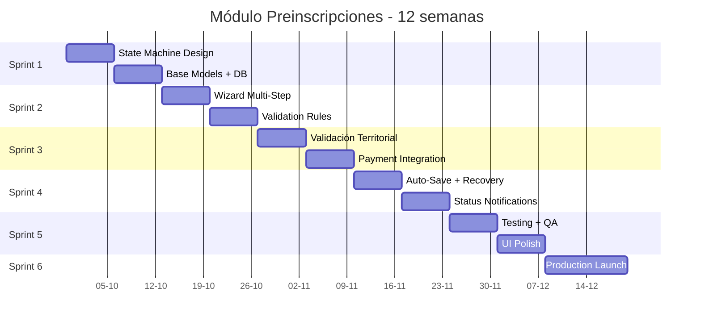
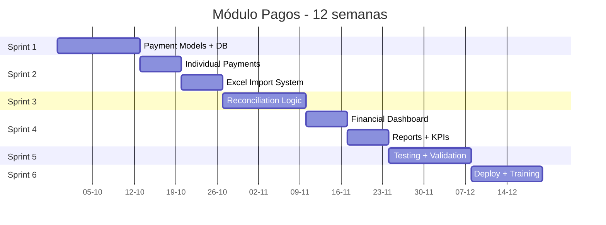
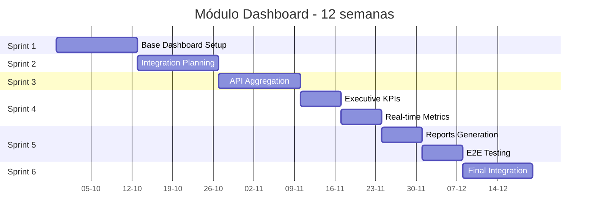
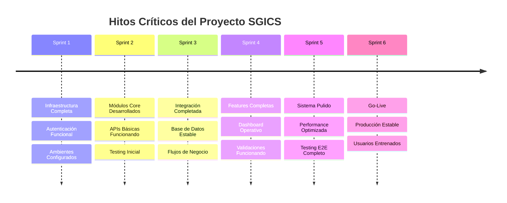

# CARTA GANTT - PROYECTO SGICS

**Proyecto:** Sistema de Gestión Integral para Cursos Scouts (SGICS)  
**Duración:** 12 semanas (6 sprints de 2 semanas)  
**Fecha Inicio:** 29 Septiembre 2025  
**Fecha Fin:** 20 Diciembre 2025  
**Equipo:** 14 desarrolladores en 6 módulos especializados

---

## 📅 **CRONOGRAMA GENERAL DEL PROYECTO**



---

## 🏗️ **CRONOGRAMA DETALLADO POR MÓDULOS**

### **MÓDULO 1: ARCHIVOS (Giovanni Pacheco - Ricardo Sanhueza)**



### **MÓDULO 2: CURSOS (Nicolás Irribarra - Lucas Guerrero)**



### **MÓDULO 3: NOTIFICACIONES (Marisol Sáez - Lucas Betanzos - Rodrigo Jara - Josué Vásquez)**



### **MÓDULO 4: PREINSCRIPCIONES (Miguel Contreras - Juan Orrego - Leonardo López)**



### **MÓDULO 5: PAGOS (Camilo Colivoro)**



### **MÓDULO 6: DASHBOARD (Nicolás González - Juan Herrera)**



---

## 🎯 **HITOS PRINCIPALES**



---

## 📊 **DISTRIBUCIÓN DE ESFUERZO POR SPRINT**

| Sprint | Semanas | Archivos | Cursos | Notificaciones | Preinscripciones | Pagos | Dashboard | Total Points |
|--------|---------|----------|---------|---------------|------------------|-------|-----------|--------------|
| Sprint 1 | 1-2 | 40 | 35 | 25 | 30 | 20 | 25 | 175 |
| Sprint 2 | 3-4 | 45 | 40 | 35 | 40 | 25 | 20 | 205 |
| Sprint 3 | 5-6 | 35 | 35 | 30 | 35 | 30 | 35 | 200 |
| Sprint 4 | 7-8 | 25 | 30 | 40 | 30 | 35 | 45 | 205 |
| Sprint 5 | 9-10 | 30 | 25 | 30 | 25 | 25 | 30 | 165 |
| Sprint 6 | 11-12 | 25 | 20 | 20 | 20 | 15 | 25 | 125 |

**Total Proyecto:** 1,075 story points en 12 semanas

---

## ⚠️ **RIESGOS Y DEPENDENCIAS**

### **Riesgos Críticos:**
1. **Dependencia SQL Server Legacy** - Mitigación: Fallbacks DRF locales
2. **Integración Compleja** - Mitigación: APIs bien definidas desde Sprint 1
3. **Performance BD** - Mitigación: Índices y optimización en Sprint 3
4. **Testing E2E** - Mitigación: Testing continuo desde Sprint 2

### **Dependencias Críticas:**
```
CURSOS → PREINSCRIPCIONES → PAGOS → DASHBOARD
    ↓         ↓              ↓
NOTIFICACIONES (eventos de cambio de estado)
    ↓
ARCHIVOS (documentos por curso)
```

---

## 🚀 **CRITERIOS DE ÉXITO POR SPRINT**

### **Sprint 1 - Fundaciones (Semanas 1-2):**
- [ ] Docker compose funcional al 100%
- [ ] Autenticación JWT operativa
- [ ] CI/CD pipeline ejecutándose
- [ ] Ambientes dev/staging configurados

### **Sprint 2 - Core Development (Semanas 3-4):**
- [ ] Todos los módulos con CRUD básico
- [ ] APIs documentadas y funcionando
- [ ] Testing unitario >70% coverage
- [ ] Integración base entre módulos

### **Sprint 3 - Integración (Semanas 5-6):**
- [ ] Flujos end-to-end funcionando
- [ ] Base de datos optimizada
- [ ] Performance tests passed
- [ ] Security audit inicial

### **Sprint 4 - Funcionalidades (Semanas 7-8):**
- [ ] Dashboard con métricas reales
- [ ] Notificaciones automáticas
- [ ] Reportes generándose
- [ ] Validaciones territoriales completas

### **Sprint 5 - Refinamiento (Semanas 9-10):**
- [ ] UI/UX pulida y responsive
- [ ] Performance optimizada
- [ ] Testing E2E completo
- [ ] Security hardening

### **Sprint 6 - Go Live (Semanas 11-12):**
- [ ] Deploy producción exitoso
- [ ] Usuarios entrenados
- [ ] Documentación completa
- [ ] Sistema monitoreado

---

**✅ Esta Carta Gantt asegura entregas incrementales cada 2 semanas con valor de negocio demostrable y riesgo controlado.**