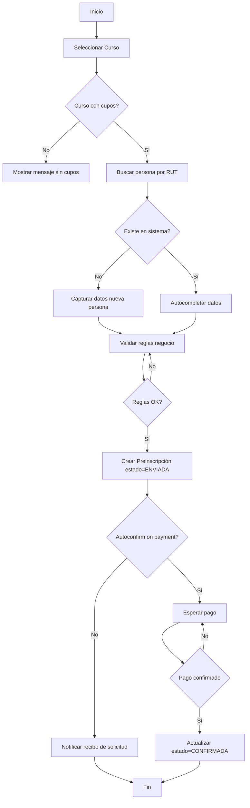
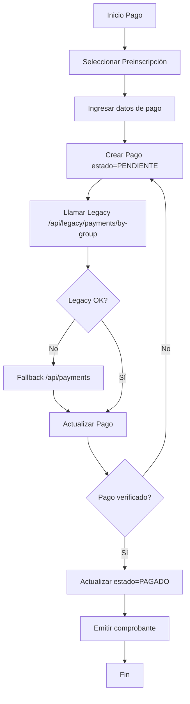
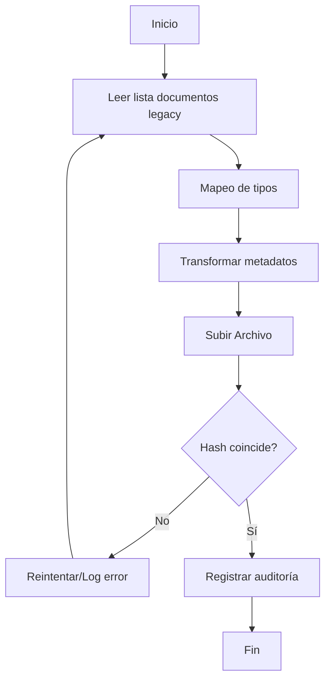
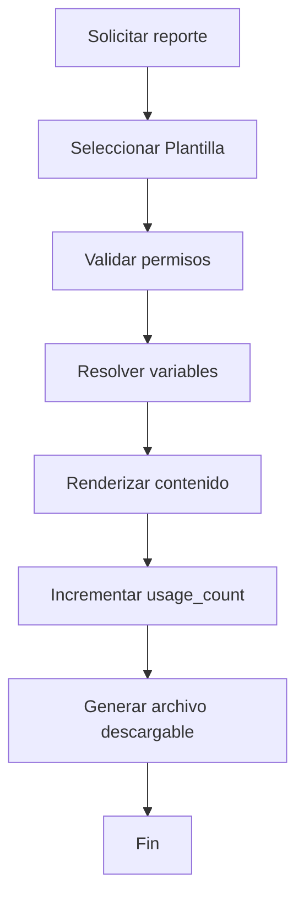
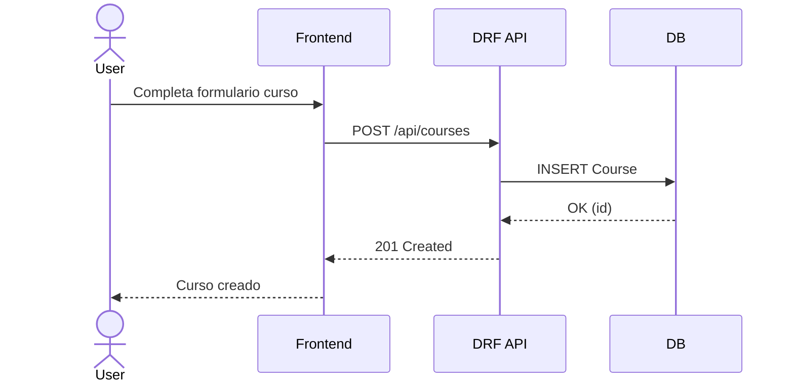
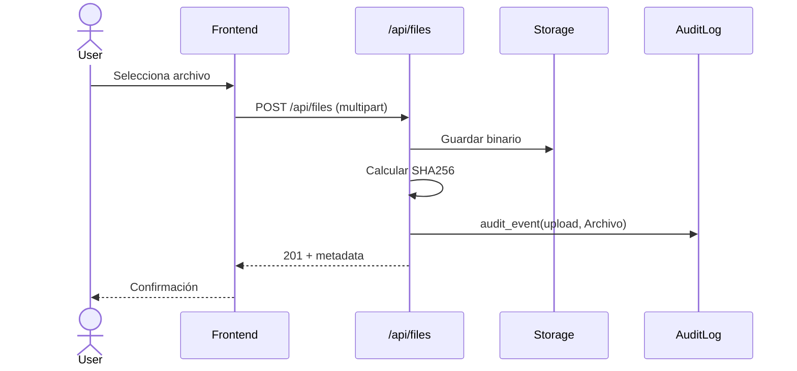
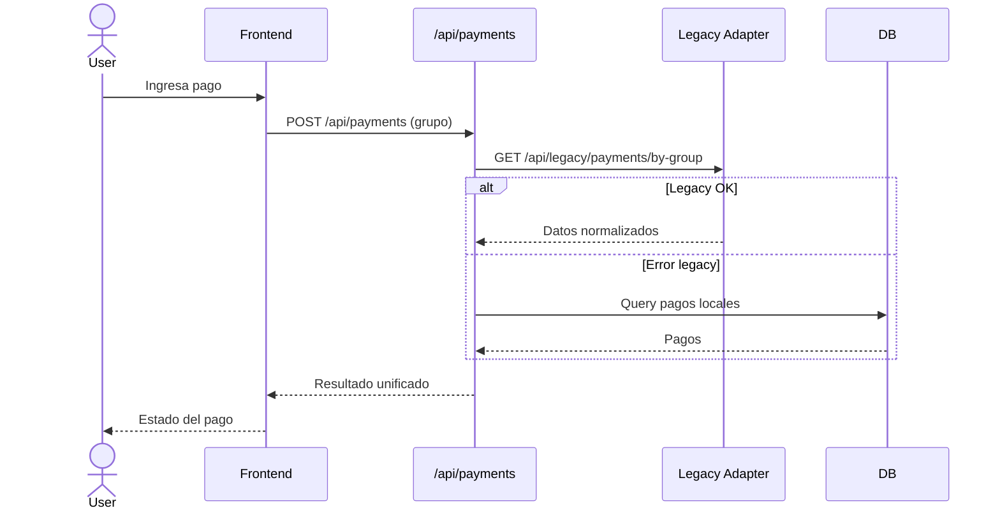
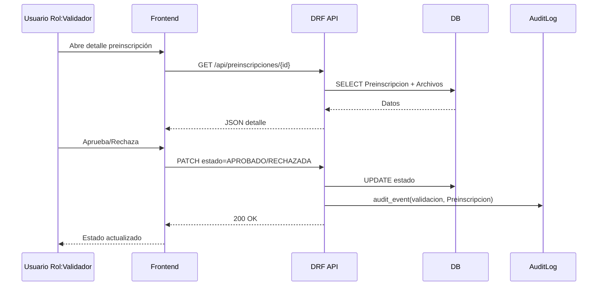

# Diagramas UML Actualizados (Mermaid / draw.io)

Fecha: 2025-10-03  
Proyecto: SGICS — Sistema de Gestión de Inscripciones, Cursos y Scouts  
Estado: Versión inicial para revisión del PO / Arquitectura

---

## 1. Instrucciones de uso en draw.io
1. Abre draw.io (app o web).  
2. Menú: Arrange > Insert > Advanced > Mermaid.  
3. Pega el bloque Mermaid deseado y pulsa Insert.  
4. Para diagramas extensos: inserta por dominios (cursos, usuarios, pagos, etc.).  
5. Ajusta layout automático si se superponen (Menú Layout > Hierarchical / Organic).  

Sugerencia: Mantener un diagrama maestro y subdiagramas por módulo para evitar densidad excesiva (>50 nodos).  

---

## 2. Supuestos y Estereotipos
| Estereotipo | Significado |
|-------------|------------|
| <<Entidad>> | Clase persistida (modelo Django actual) |
| <<Agregado>> | Raíz de agregado funcional (DDD ligero) |
| <<Servicio>> | Servicio de dominio / aplicación (implícito) |
| <<Planned>> | Clase prevista por requerimientos pero aún no implementada |
| <<LegacyProxy>> | Endpoint/servicio puente a SQL Server legacy |
| <<Valor>> | Objeto de valor (no persistido standalone) |

---

## 3. Gap Analysis (Modelos vs Requerimientos)
| Dominio | Requerimiento | Implementado | Falta / Observación |
|---------|---------------|--------------|---------------------|
| Preinscripciones | RF-03 | Parcial (no modelo visible en repo) | Se modela clase `Preinscripcion` (<<Planned>>) para flujos y relaciones (referenciada por `Archivo`). |
| Pagos | RF-04 | No | Se propone `Pago`, `Cuota` (<<Planned>>) para soportar RF-04.5. |
| Notificaciones | RF-06 | No | `Notificacion`, `CanalEnvio` (opcional) marcadas <<Planned>>. |
| Seguridad / Roles | RF-07 | Parcial | Existen `Role`, `RoleAssignment`; faltaría mapear permisos a endpoints (fuera de alcance diagrama estructural). |
| Auditoría | RF-07.3 | Sí | `AuditLog` implementado. |
| Documentos | RF-05 | Parcial | `Archivo` y `DocumentTemplate` presentes; falta versionado avanzado (atributos futuros: `version`, `parent_id`). |
| Cursos KPIs | RF-01 / RF-02 | Sí | `Course`, `Category`; se sugiere vista agregada (<<LegacyProxy>>). |

---

## 4. Diagrama de Clases (Vista Global)
Dividido en paquetes lógicos para legibilidad. Puedes generar uno por sección si draw.io se satura.

```mermaid
%% Diagrama de clases global (simplificado)
classDiagram
direction TB

package Usuarios {
    class User <<Entidad>> {
        +username: str
        +email: str
        +rut: str?
        +password: hash
        +is_active: bool
    }
    class Role <<Entidad>> {
        +code: str
        +description: str
    }
    class RoleAssignment <<Entidad>> {
        +scope_type: str
        +scope_id: int?
    }
    User "1" -- "*" RoleAssignment : asigna >
    Role "1" -- "*" RoleAssignment : rol >
}

package Cursos {
    class Course <<Entidad>><<Agregado>> {
        +title: str
        +description: text
        +rama: enum
        +status: enum
        +price: decimal
        +duration_hours: int
        +max_participants: int
        +start_date: date
        +end_date: date
        +autoconfirm_on_payment: bool
        +available_slots(): int
        +enrollment_count(): int
        +payment_status_summary(): dict
        +team_status(): dict
        +semaforo_status(): enum
    }
    class Category <<Entidad>> {
        +name: str
        +description: text
    }
    Course --> Category : category
    Course --> User : created_by
    Course "*" -- "*" User : formadores
    Course "*" -- "*" User : coordinadores
}

package Preinscripciones {
    class Preinscripcion <<Agregado>> {
        +rut: str
        +estado: enum
        +fecha: datetime
        +esta_al_dia_pagos(): bool
    }
    Preinscripcion --> Course : curso
    Preinscripcion --> User : persona
}

package Pagos {
    class Pago {
        +monto: decimal
        +metodo: enum
        +estado: enum
        +fecha: datetime
        +referencia: str
    }
    class Cuota {
        +numero: int
        +monto: decimal
        +vencimiento: date
        +pagada: bool
    }
    Preinscripcion "1" -- "*" Pago : pagos
    Pago "1" -- "*" Cuota : cuotas
}

package Archivos {
    class Archivo <<Entidad>> {
        +tipo: enum
        +filename: str
        +mime: str
        +size_bytes: int
        +hash_sha256: str
        +estado: enum
        +created_at: datetime
    }
    Archivo --> User : owner
    Archivo --> Preinscripcion : preinscripcion
}

package Plantillas {
    class DocumentTemplate <<Entidad>> {
        +name: str
        +category: enum
        +content: text
        +variables: json[]
        +usage_count: int
        +is_active: bool
        +register_usage()
    }
    DocumentTemplate --> User : created_by
}

package Notificaciones {
    class Notificacion {
        +tipo: enum
        +contenido: text
        +estado: enum
        +enviado_at: datetime?
    }
    Notificacion --> User : destinatario
    Notificacion --> User : creador
}

package Auditoria {
    class AuditLog <<Entidad>> {
        +accion: str
        +entidad: str
        +entidad_id: int
        +payload_json: json
        +ip: str
        +created_at: datetime
    }
    AuditLog --> User : actor
}

package IntegracionLegacy {
    class LegacyPaymentsAdapter <<LegacyProxy>> {
        +fetchByGroup(grupoId): json
    }
    class LegacyCoursesAdapter <<LegacyProxy>> {
        +fetchKPIs(): json
    }
    LegacyPaymentsAdapter ..> Pago : normaliza
    LegacyCoursesAdapter ..> Course : complementa
}
```

---

## 5. Diagramas de Actividad

### 5.1 Flujo de Preinscripción


### 5.2 Flujo de Validación Scout
```mermaid
flowchart TD
    A[Inicio Validación] --> B[Recibir Preinscripción]
    B --> C[Verificar documentación]
    C --> D{Documentos completos?}
    D -- No --> E[Solicitar corrección]
    E --> B
    D -- Sí --> F[Evaluar criterios (edad, rama, roles)]
    F --> G{Cumple criterios?}
    G -- No --> H[Rechazar / estado=RECHAZADA]
    G -- Sí --> I[Marcar estado=APROBADO]
    H --> J[Registrar auditoría]
    I --> J[Registrar auditoría]
    J --> K[Fin]
```

### 5.3 Flujo de Pago


### 5.4 Flujo Migración Documentos (Simplificado)


### 5.5 Generación de Reporte (Plantillas)


---

## 6. Diagramas de Secuencia

### 6.1 Registrar Curso


### 6.2 Subir Documento (Archivo)


### 6.3 Procesar Pago con Fallback


### 6.4 Validar Scout (Preinscripción)


### 6.5 Auditoría de Acción Genérica
```mermaid
sequenceDiagram
    actor Actor as User
    participant API as DRF API
    participant AUD as AuditLog Service
    participant DB as DB
    Actor->>API: Acción (e.g. editar curso)
    API->>DB: UPDATE entidad
    API->>AUD: audit_event("UPDATE","Course", id)
    AUD->>DB: INSERT AuditLog
    DB-->>AUD: OK
    API-->>Actor: Resultado
```

---

## 7. Extensiones Futuras Recomendadas
1. Añadir `VersionedArchivo` o atributo `version` para histórico de archivos.  
2. Introducir `PaymentGateway` (estrategía) para soportar múltiples métodos.  
3. Formalizar `NotificationChannel` (email, interno, push).  
4. Agregar `DomainEvent` para desacoplar auditoría y side-effects.  
5. Crear vista materializada o procedimiento para KPI `recaudado_real`.  

---

## 8. Notas
- Las clases <<Planned>> sirven para alinear diseño con RF pendientes y evitar refactors disruptivos.  
- Los nombres de métodos calculados en `Course` podrían migrarse a servicios si crece la lógica.  
- `RoleAssignment` soporta scopes; si se añade multi-tenancy, considerar objeto valor `Scope` formal.  

---

Fin del documento.
