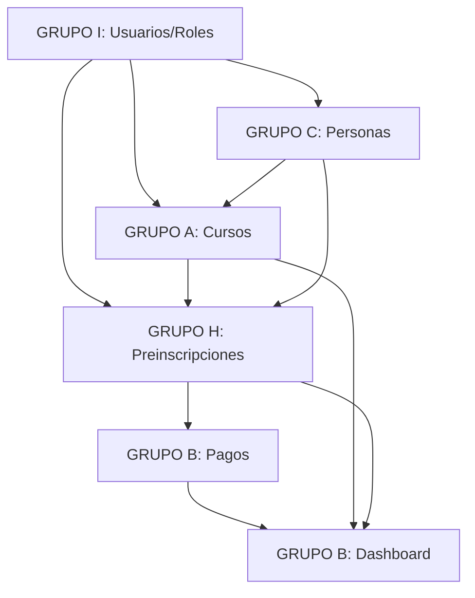

# 📋 LÓGICA DE ASIGNACIÓN DE TAREAS - SPRINT 2 SGICS

**Fecha:** 15 de Octubre 2025  
**Sprint:** N2 (13-24 Oct 2025)  
**Documento:** Distribución detallada de módulos y tareas por equipo

---

## 🎯 RESUMEN EJECUTIVO

Se han identificado **6 módulos principales** para el sistema SGICS, distribuidos entre **5 grupos de trabajo**. La asignación se basa en especialidades técnicas, carga de trabajo balanceada y minimización de dependencias entre equipos.

### **Estado Actual:**
- ✅ **Pagos**: 75% completo (Grupo B)
- ✅ **DevOps/CI**: 60% completo (Grupo C)
- 🟡 **Autenticación**: 15% completo → **REASIGNADO**
- 🔴 **Resto de módulos**: 0-10% completo

---

## 📊 NUEVA DISTRIBUCIÓN DE MÓDULOS

### **🔄 CAMBIOS PRINCIPALES:**

1. **GRUPO I (antes Grupo Z)** → **USUARIOS Y ROLES**
   - ✅ **Justificación**: Marisol, Lucas B. y Josué tienen expertise en UI/UX y gestión de perfiles
   - ✅ **Tareas**: 8 stories (43 story points total)
   - ✅ **Enfoque**: RBAC completo, gestión de usuarios, permisos por módulo

2. **GRUPO A** → **CURSOS + CATÁLOGO TERRITORIAL** (antes Autenticación)
   - ✅ **Justificación**: Nicolas I., Lucas G. y Axel liberados de Auth (ya cubierto por Grupo I)
   - ✅ **Tareas**: 11 stories (59 story points total)
   - ✅ **Enfoque**: Gestión completa de cursos, categorías, equipos de curso, catálogo territorial jerárquico

3. **GRUPO B** → **PAGOS (completar) + DASHBOARD + QA**
   - ✅ **Justificación**: Camilo (experto en pagos) + Juan S. (QA)
   - ✅ **Tareas**: 10 stories (52 story points total)
   - ✅ **Enfoque**: Finalizar módulo de pagos (reconciliación, reportes), dashboard ejecutivo con KPIs, QA E2E

4. **GRUPO H** → **PREINSCRIPCIONES + ARCHIVOS**
   - ✅ **Justificación**: Miguel, Juan O. y Leonardo (especialidad en formularios)
   - ✅ **Tareas**: 10 stories (52 story points total)
   - ✅ **Enfoque**: Wizard completo 3 pasos, máquina de estados, upload/validación de archivos

5. **GRUPO C** → **DEVOPS + PERSONAS + INFRAESTRUCTURA**
   - ✅ **Justificación**: Ricardo S., Giovanni y Ricardo H. (DevOps/Backend)
   - ✅ **Tareas**: 11 stories (54 story points total)
   - ✅ **Enfoque**: CI/CD completo, gestión de personas, búsqueda por RUT, importación masiva

---

## 📋 DETALLE POR GRUPO

### **👥 GRUPO I - USUARIOS Y ROLES**
**Miembros:** Marisol Sáez (Lead), Lucas Betanzo, Josué Vásquez  
**Módulo:** Usuarios y Roles  
**Story Points:** 43 puntos  
**Prioridad:** ALTA (Módulo crítico para el resto del sistema)

#### **Tareas Asignadas:**

1. **SGICS-I-001** [8 pts] - Crear modelos User, Role, RoleAssignment
   - User extendido con campos Scout (RUT, rama, grupo_scout, cargo)
   - Role con permisos JSON
   - RoleAssignment con scope (global/grupo/curso)
   - Migraciones completas

2. **SGICS-I-002** [5 pts] - Implementar serializadores y vistas REST
   - UserSerializer con validación de RUT
   - ViewSet completo con acciones: me, search_by_rut
   - Filtros avanzados

3. **SGICS-I-003** [8 pts] - RBAC completo con permisos por módulo
   - Sistema de permisos granulares
   - Middleware de verificación
   - Decoradores @require_permission
   - Integración con DRF permissions

4. **SGICS-I-004** [5 pts] - Endpoints de gestión de roles
   - CRUD de roles
   - Asignación/revocación de roles a usuarios
   - Validaciones de permisos

5. **SGICS-I-005** [5 pts] - UI de gestión de usuarios (Vue)
   - UserList.vue con filtros
   - UserForm.vue con validación RUT
   - UserProfile.vue

6. **SGICS-I-006** [5 pts] - UI de gestión de roles y permisos
   - RoleManager.vue
   - PermissionMatrix.vue (matriz de permisos)
   - UserRoleAssignment.vue

7. **SGICS-I-007** [5 pts] - Tests unitarios e integración
   - Tests pytest-django (coverage 85%+)
   - Tests Vitest para componentes Vue

8. **SGICS-I-008** [3 pts] - Documentación y diagramas UML
   - OpenAPI/Swagger
   - Diagramas: clases, secuencia, actividad

---

### **👥 GRUPO A - CURSOS Y CATÁLOGO TERRITORIAL**
**Miembros:** Nicolas Irribarra (Lead), Lucas Guerrero, Axel Villa  
**Módulos:** Cursos + Catálogo Territorial  
**Story Points:** 59 puntos  
**Prioridad:** ALTA (Módulo central del sistema)

#### **Tareas Asignadas:**

1. **SGICS-A-001** [8 pts] - Modelo Course completo
   - Estados: DRAFT, ACTIVE, INACTIVE, ARCHIVED
   - CourseTeam (coordinador, formadores, asistentes)
   - Migraciones

2. **SGICS-A-002** [5 pts] - API REST para cursos
   - CRUD completo
   - Filtros: rama, status, category
   - Acciones: activate, archive, get_metrics

3. **SGICS-A-003** [3 pts] - Sistema de categorías y ramas
   - Modelo Category
   - Constantes de ramas Scout
   - Vista filtrada por rama

4. **SGICS-A-004** [5 pts] - Gestión de equipos de curso
   - Asignación de coordinadores/formadores
   - Validaciones (un coordinador por curso)
   - Endpoints de team management

5. **SGICS-A-005** [8 pts] - Modelos de catálogo territorial
   - Region, Zona, Distrito, Grupo
   - Relaciones jerárquicas
   - Datos iniciales de Chile

6. **SGICS-A-006** [5 pts] - API de catálogo con filtros
   - Endpoints jerárquicos
   - Filtros en cascada
   - Serializers anidados

7. **SGICS-A-007** [5 pts] - UI de gestión de cursos
   - CourseList.vue con grid
   - CourseForm.vue con validaciones
   - CourseDetail.vue

8. **SGICS-A-008** [3 pts] - UI de asignación de equipos
   - CourseTeamManager.vue
   - Drag & drop para asignaciones
   - Modal de selección

9. **SGICS-A-009** [5 pts] - Selector territorial jerárquico
   - TerritorialSelector.vue
   - Cascading selects (Región→Zona→Distrito→Grupo)
   - Lazy loading

10. **SGICS-A-010** [5 pts] - Tests cursos y catálogo
    - Tests pytest y Vitest
    - Coverage 80%+

11. **SGICS-A-011** [3 pts] - Documentación y diagramas

---

### **👥 GRUPO B - PAGOS + DASHBOARD + QA**
**Miembros:** Camilo Colivoro (Pagos Lead), Juan Sebastián Iglesias (QA Lead)  
**Módulos:** Pagos (completar 25%), Dashboard, QA  
**Story Points:** 52 puntos  
**Prioridad:** ALTA (Módulo financiero crítico)

#### **Tareas Asignadas:**

**PAGOS (Completar 25% restante):**

1. **SGICS-B-001** [3 pts] - Validaciones avanzadas
   - Monto mínimo/máximo
   - Referencia bancaria única
   - Detección de duplicados

2. **SGICS-B-002** [8 pts] - Reconciliación automática
   - Parser de archivos bancarios
   - Algoritmo de matching
   - Vista de no reconciliados

3. **SGICS-B-003** [5 pts] - Reportes financieros
   - Summary por grupo/curso/período
   - Exportación CSV/Excel
   - Proyecciones

4. **SGICS-B-004** [5 pts] - UI de reconciliación
   - Upload archivo banco
   - Preview de matches
   - Confirmación manual

**DASHBOARD:**

5. **SGICS-B-005** [8 pts] - Dashboard ejecutivo con KPIs
   - KPI cards (preinscripciones, pagos, cursos)
   - Gráficos Chart.js
   - Métricas en tiempo real

6. **SGICS-B-006** [5 pts] - Semáforo de cursos
   - Lógica: verde (>80%), amarillo (50-80%), rojo (<50%)
   - Alertas automáticas
   - Integración en dashboard

7. **SGICS-B-007** [5 pts] - Sistema de métricas backend
   - Endpoints de agregación
   - Cache con Redis
   - Optimización de queries

**QA:**

8. **SGICS-B-008** [8 pts] - Tests E2E con Playwright
   - Flujos críticos completos
   - Integración en CI/CD

9. **SGICS-B-009** [5 pts] - Tests de integración entre módulos
   - Mocks de servicios
   - Coverage 85%+

10. **SGICS-B-010** [3 pts] - Documentación

---

### **👥 GRUPO H - PREINSCRIPCIONES + ARCHIVOS**
**Miembros:** Miguel Contreras (Lead), Juan Orrego, Leonardo López  
**Módulos:** Preinscripciones + Archivos  
**Story Points:** 52 puntos  
**Prioridad:** ALTA (Módulo de negocio crítico)

#### **Tareas Asignadas:**

**PREINSCRIPCIONES:**

1. **SGICS-H-001** [8 pts] - Wizard pasos 2 y 3
   - Step2: datos personales
   - Step3: confirmación
   - Navegación y persistencia

2. **SGICS-H-002** [8 pts] - Máquina de estados
   - 7 estados completos
   - Transiciones automáticas
   - Backend + frontend sync

3. **SGICS-H-003** [5 pts] - Notificaciones automáticas
   - Email por cambio de estado
   - Templates
   - Integración Celery

4. **SGICS-H-004** [5 pts] - Validaciones territoriales
   - Validar grupo/distrito
   - Cupos por territorio
   - Restricciones por rama

**ARCHIVOS:**

5. **SGICS-H-005** [8 pts] - Módulo de archivos completo
   - File model
   - Endpoints upload/download
   - Storage /media o S3

6. **SGICS-H-006** [5 pts] - Validaciones de archivos
   - Tipos permitidos
   - Tamaño máximo 10MB
   - Escaneo antivirus ClamAV

7. **SGICS-H-007** [5 pts] - UI upload drag & drop
   - FileUploader.vue
   - Progress bar
   - Preview

8. **SGICS-H-008** [3 pts] - Galería de archivos
   - Grid con thumbnails
   - Filtros y búsqueda
   - Lightbox

9. **SGICS-H-009** [5 pts] - Tests

10. **SGICS-H-010** [3 pts] - Documentación

---

### **👥 GRUPO C - DEVOPS + PERSONAS + INFRAESTRUCTURA**
**Miembros:** Ricardo Sanhueza (SM/Lead), Giovanni Pacheco (DevOps), Ricardo Henríquez  
**Módulos:** DevOps + Personas + Infraestructura  
**Story Points:** 54 puntos  
**Prioridad:** ALTA (Infraestructura crítica)

#### **Tareas Asignadas:**

**DEVOPS:**

1. **SGICS-C-001** [5 pts] - CI/CD completo ✅ LISTO
   - GitHub Actions
   - Tests automáticos
   - Deploy staging

2. **SGICS-C-002** [5 pts] - SonarQube 🟡 EN PROGRESO
   - Análisis de calidad
   - Security vulnerabilities
   - Gate de calidad

3. **SGICS-C-003** [3 pts] - Health checks ✅ LISTO
   - /healthz/ y /readyz/
   - Kubernetes probes
   - Logging estructurado

**PERSONAS:**

4. **SGICS-C-004** [8 pts] - API de gestión de personas
   - Person model con RUT
   - CRUD completo
   - Búsqueda por RUT

5. **SGICS-C-005** [5 pts] - Búsqueda avanzada
   - Filtros múltiples
   - Paginación
   - Índices de BD

6. **SGICS-C-006** [8 pts] - Importación masiva
   - Parser Excel/CSV
   - Validación de datos
   - Background tasks

7. **SGICS-C-007** [5 pts] - UI de gestión de personas
   - PersonList.vue
   - PersonForm.vue con RUT
   - Autocomplete

**INFRAESTRUCTURA:**

8. **SGICS-C-008** [5 pts] - Backup automático
   - Script diario MySQL
   - Storage S3/MinIO
   - Restauración

9. **SGICS-C-009** [5 pts] - Logging centralizado
   - Sentry para errores
   - Logging estructurado
   - Dashboard

10. **SGICS-C-010** [5 pts] - Tests

11. **SGICS-C-011** [3 pts] - Documentación

---

## 🎯 TAREAS TRANSVERSALES (TODOS LOS GRUPOS)

### **SGICS-ALL-001** [5 pts] - Diagramas UML por módulo
- Cada equipo actualiza sus diagramas:
  - Diagrama de Clases
  - Diagrama de Secuencia
  - Diagrama de Actividad
- Guardar en `/docs/diagrams/`
- Usar draw.io o PlantUML

### **SGICS-ALL-002** [3 pts] - Documentación OpenAPI
- Decoradores `@swagger_auto_schema`
- Schema.yml automático
- Swagger UI en `/api/docs/`

### **SGICS-ALL-003** [5 pts] - Demo Sprint 2
- Ricardo Sanhueza (coordinación)
- Demo funcional completa
- Slides con métricas
- Video de 5 minutos

---

## 📊 RESUMEN DE STORY POINTS POR GRUPO

| Grupo | Miembros | Módulos | Story Points | % Carga | Prioridad |
|-------|----------|---------|--------------|---------|-----------|
| **GRUPO I** | 3 | Usuarios y Roles | 43 pts | 17% | 🔴 ALTA |
| **GRUPO A** | 3 | Cursos + Catálogo | 59 pts | 24% | 🔴 ALTA |
| **GRUPO B** | 2 | Pagos + Dashboard + QA | 52 pts | 21% | 🔴 ALTA |
| **GRUPO H** | 3 | Preinscripciones + Archivos | 52 pts | 21% | 🔴 ALTA |
| **GRUPO C** | 3 | DevOps + Personas | 54 pts | 22% | 🔴 ALTA |
| **TODOS** | - | Transversal | 13 pts | 5% | 🟡 MEDIA |
| **TOTAL** | **14 personas** | **6 módulos** | **273 pts** | **100%** | - |

---

## 🔄 DEPENDENCIAS ENTRE MÓDULOS

### **Dependencias Críticas:**

1. **GRUPO I → Todos** (Usuarios y Roles)
   - Sistema de autenticación y permisos debe estar completo primero
   - Prioridad: Completar en Semana 1

2. **GRUPO A → GRUPO H** (Cursos → Preinscripciones)
   - Preinscripciones necesita API de cursos
   - Coordinación: Definir contratos de API temprano

3. **GRUPO H → GRUPO B** (Preinscripciones → Pagos)
   - Pagos depende de ID de preinscripción
   - Estado: Pagos ya 75% completo, menos crítico

4. **GRUPO C → Todos** (DevOps/Infraestructura)
   - CI/CD debe estar activo desde día 1
   - Health checks necesarios para deploy

---

## 📅 CRONOGRAMA RECOMENDADO

### **SEMANA 1 (15-18 Oct):**

**GRUPO I** (CRÍTICO):
- ✅ Día 1-2: Modelos User/Role/RoleAssignment
- ✅ Día 3-4: API REST completa
- ✅ Día 4-5: RBAC básico funcionando

**GRUPO A:**
- ✅ Día 1-2: Modelos Course y Territorial
- ✅ Día 3-4: APIs REST
- ✅ Día 5: Integración con Grupo I

**GRUPO B:**
- ✅ Día 1-2: Completar validaciones de pagos
- ✅ Día 3-5: Reconciliación automática

**GRUPO H:**
- ✅ Día 1-3: Wizard pasos 2-3
- ✅ Día 4-5: Máquina de estados

**GRUPO C:**
- ✅ Día 1-2: Finalizar CI/CD y SonarQube
- ✅ Día 3-5: API de Personas

### **SEMANA 2 (21-24 Oct):**

**GRUPO I:**
- ✅ Día 1-2: UI de gestión de usuarios
- ✅ Día 3: UI de roles y permisos
- ✅ Día 4: Tests y documentación

**GRUPO A:**
- ✅ Día 1-2: UI de cursos
- ✅ Día 2-3: Selector territorial
- ✅ Día 4: Tests y documentación

**GRUPO B:**
- ✅ Día 1-2: Dashboard con KPIs
- ✅ Día 3: Tests E2E
- ✅ Día 4: Documentación

**GRUPO H:**
- ✅ Día 1-2: Módulo de archivos completo
- ✅ Día 3: Validaciones y UI
- ✅ Día 4: Tests y documentación

**GRUPO C:**
- ✅ Día 1-2: UI de personas
- ✅ Día 2-3: Importación masiva
- ✅ Día 4: Tests y documentación

**TODOS:**
- ✅ Día 4: Diagramas UML actualizados
- ✅ Día 4: Demo Sprint 2

---

## 🎯 CRITERIOS DE ACEPTACIÓN DEL SPRINT

### **Must Have (Crítico para cierre de Sprint):**

✅ **GRUPO I:**
- [ ] Modelos User/Role/RoleAssignment completos
- [ ] API REST funcional con RBAC
- [ ] UI de gestión de usuarios básica

✅ **GRUPO A:**
- [ ] API de cursos funcional
- [ ] Catálogo territorial con datos de Chile
- [ ] UI de lista y creación de cursos

✅ **GRUPO B:**
- [ ] Módulo de pagos 100% completo
- [ ] Dashboard con KPIs principales
- [ ] Coverage tests >80%

✅ **GRUPO H:**
- [ ] Wizard 3 pasos funcional
- [ ] Upload de archivos con validaciones
- [ ] Máquina de estados básica

✅ **GRUPO C:**
- [ ] CI/CD completo y operativo
- [ ] API de personas con búsqueda por RUT
- [ ] Health checks funcionando

### **Should Have (Deseable):**

- [ ] Tests E2E completos
- [ ] Documentación OpenAPI completa
- [ ] Diagramas UML actualizados
- [ ] SonarQube configurado

### **Could Have (Bonus):**

- [ ] Importación masiva de personas
- [ ] Reconciliación automática de pagos
- [ ] Notificaciones automáticas
- [ ] Backup automático configurado

---

## 📈 MÉTRICAS DE ÉXITO

### **Código:**
- ✅ Coverage backend: >80%
- ✅ Coverage frontend: >70%
- ✅ SonarQube: 0 bugs críticos
- ✅ Linting: 0 errores

### **Funcionalidad:**
- ✅ Login funcional con JWT
- ✅ CRUD completo de al menos 3 módulos
- ✅ Flujo completo: Crear curso → Preinscribir → Pagar

### **Documentación:**
- ✅ README actualizado por módulo
- ✅ Diagramas UML por módulo
- ✅ OpenAPI completo

### **Colaboración:**
- ✅ 100% commits con convención SGICS-XXX
- ✅ PRs con mínimo 1 review
- ✅ Daily standups realizados

---

## 🚀 PRÓXIMOS PASOS INMEDIATOS

### **HOY (15 Oct):**
1. ✅ Importar `Jira_SGICS_Sprint2_Actualizado.csv` a Jira
2. ✅ Asignar tareas a cada miembro del equipo
3. ✅ Crear branches: `feature/SGICS-XXX-description`
4. ✅ Kickoff meeting por equipo (30 min)

### **MAÑANA (16 Oct):**
1. ✅ Primer daily standup 9:00 AM
2. ✅ GRUPO I: Iniciar modelos User/Role
3. ✅ GRUPO A: Iniciar modelos Course
4. ✅ GRUPO B: Validaciones avanzadas pagos
5. ✅ GRUPO H: Wizard paso 2
6. ✅ GRUPO C: API de personas

### **ESTA SEMANA:**
1. ✅ Definir contratos de API entre módulos
2. ✅ Setup de environments de desarrollo
3. ✅ Integración continua funcionando
4. ✅ Primera demo interna (Viernes 18 Oct)

---

## 📞 CONTACTO Y COORDINACIÓN

**Scrum Master:** Ricardo Sanhueza  
**Canal Técnico:** Discord #desarrollo  
**Daily Standups:** 9:00 AM (15 min)  
**Dudas/Bloqueos:** Slack @rsanhueza

**Reuniones Semanales:**
- **Lunes:** Planning y dependencias
- **Miércoles:** Integration checkpoint
- **Viernes:** Demo y retrospective

---

## ✅ CHECKLIST DE IMPORTACIÓN A JIRA

- [ ] Importar CSV a Jira
- [ ] Asignar épicas a equipos
- [ ] Configurar tablero Sprint 2
- [ ] Activar notificaciones por equipo
- [ ] Compartir link de tablero con todos
- [ ] Verificar story points asignados
- [ ] Crear filtros por equipo
- [ ] Configurar sprint burndown

---

**🎯 ¡Sprint 2 listo para comenzar! Todos los equipos tienen tareas claras y balanceadas. Éxito en el desarrollo! 🚀**
